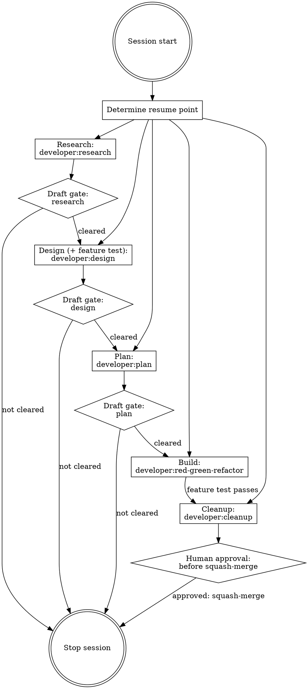

# developer:ailly

## Overview

Session coordinator for a development loop. Creates and manages the session folder, passes it to each skill, enforces draft gates, and determines where to resume when re-entering an existing session.

**Announce at start:** "Using developer:ailly to coordinate this session."

## Session Folder

If it does not exist, create `docs/developer/YYYY-MM-DD-A-<topic>` where `A` is `A`, `B`, `C`, etc to manage multiple features started in the same day. If not already on a branch of the same name, suggest moving to that branch, and let the user make the switch. When the branch needs upstream changes, prefer a rebase and push with `--force-with-lease` rather than a plain force push.

If the folder already exists for the current topic, determine resume point:

| Files present | Draft marker cleared? | Resume at |
|---|---|---|
| No files | — | Research phase (`developer:research`) |
| `research.md` | No | Wait, ask user to clear the draft |
| `research.md` | Yes | Design phase (`developer:design`) |
| `design.md` | No | Wait, ask user to clear the draft |
| `design.md` | Yes | Plan phase (`developer:plan`) |
| `plan.md` | No | Wait, ask user to clear the draft |
| `plan.md` | Yes | Build (`developer:red-green-refactor`) |
| `plan.md` cleared, all steps done, feature test green | — | Cleanup phase (`developer:cleanup`) |

A file has its draft cleared when it no longer contains the `*Draft` marker.

Cleanup is the terminal phase: it runs the final review, extracts deferred decisions to `docs/developer/TASKS.md`, and **pauses for human approval before the squash-merge** or PR.

## Loop Structure

## Draft Gate Enforcement

After any research, design, or plan skill produces a draft, stop the session and tell the user:

> "This step is complete. Review `<path>`, make any changes, then remove the `*Draft YYYY-MM-DD*` marker from the top of the file. Start a new session and run `developer:ailly` to continue."

**Do not proceed past a draft gate in the same session under any circumstances.** If the user asks to continue anyway, decline:

> "I can't continue past the draft gate in this session. The draft gate exists so you have a chance to review and refine before the next step builds on it."

## Skill Invocations

Pass the session folder path to each skill. The session folder is the single source of truth for all session artifacts.

- Research phase: invoke `developer:research`
- Design phase: invoke `developer:design`
- Plan phase: invoke `developer:plan`
- Build phase: invoke `developer:red-green-refactor` per plan step until the feature test is green
- Cleanup phase: invoke `developer:cleanup`

## Topic Slug

If the user's prompt doesn't make the topic slug obvious, ask for one before creating the session folder:

> "What's a short slug for this session? (e.g., `user-auth`, `csv-export`)"

Use it to name the session folder: `docs/developer/YYYY-MM-DD-<topic>/`.

## Session Artifacts

All artifacts for a session live under `docs/developer/YYYY-MM-DD-A-<topic>/`.

- `research.md` is the gathered and refined context for a topic.
- `design.md` is the overall design doc for a topic, including the path of its one feature test.
- `maps/<path>.md` contains the maps found during any forward/backward planning. 
- `thinking/` is a scratch pad area for the `thinking` skill to share its findings with the calling agent.

## Quick-loop Mode

Generally, be persistent in enforcing the draft structure. However, when first starting an Ailly task, the user may ask for a "quick loop". The same five phases (Research, Design, Plan, Build, Cleanup) still run, compressed:

- The draft gates **auto-clear**: each phase produces its artifact and the next phase begins in the same flow, without stopping for human review between them.
- Artifacts are **minimal**: just enough research, design, plan, and feature test to drive the work, not the full documents.
- The loop **churns straight to a green feature test**, then Cleanup.
- Use subagents for each phase of the loop to maintain session isolation.

**When it fits:** a small, unambiguous task with a narrow surface, where the cost of a wrong turn is low.

**What it trades away:** the human review beats. Skipping the gates means no chance to catch a wrong assumption before the next phase builds on it. Do not use quick-loop for ambiguous, high-blast-radius, or security-sensitive work.

## Bugfix Shape

When the research refine pass reclassifies the task as a bug rather than a feature, consult `developer/references/bugfix.md`. The same five phases run; the design content uses observed / expected / unchanged language, and the feature test is a failing **reproduction** test that fills the same slot the design's feature test fills. Not a separate skill.

## Next Task

When finishing a session, append the next step to `docs/developer/TASKS.md`. When calling run, read `TASKS.md` first, then compare the user's input to the list of next steps. If the next step is obvious from context, run that. If there is no next step, start from the top. If the next step is ambiguous, ask whether they want to pick from a list or start a new developer task. When you start a task, remove it from `TASKS.md`. Ignore tasks in comments, either # lines or HTML section comments. When substantial context is needed for a task, create a `TASK-NOTES-<task>.md` file with the details, and include just a short overview to that in the TASKS file. Review NOTES when the task is selected.

When a topic is finished, use `developer:cleanup` to leave things tidy.

## Attribution

When creating git commit messages, attribute yourself. Include `Co-Authored-By: "Ailly <developer@ailly.dev>"`.
