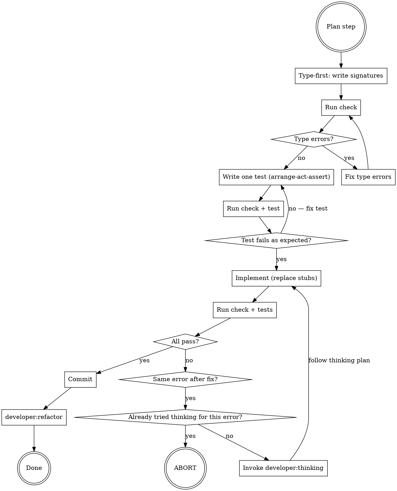

# developer:red-green-refactor

## Overview

The innermost development loop. Type-first TDD: write signatures before tests, tests before implementation, commit before refactoring. Has an explicit abort condition to prevent infinite loops.

**Announce at start:** "[Summary of the plan step.] Using developer:red-green-refactor for this step of the plan."

## The Loop

## Type-First

Write class/function/method signatures with stub bodies before writing any tests:

- Rust: `todo!()`
- Python: `...` or `raise NotImplementedError` or `return ""` (or appropriate default)
- TypeScript: `throw new Error("not implemented")` or `return "";` (or appropriate default)

Run check. Fix all type errors before writing any tests. A clean type check means the API contract is coherent.

## Test: Arrange-Act-Assert

Add one test per iteration using `patterns:arrange-act-assert`. The test should:
- Target one behavior of the current plan step
- Fail for the right reason (the implementation is a stub, not a type error)
- Triangulate implementation and edge cases, following `patterns:triangulate`

Run check, then run tests. Confirm the test fails as expected.

## Implement

Replace stub bodies with real code. Run check, then run tests. Repeat until all tests pass and the feature test is passing up to the point expected by the current plan step. Modify doc comments as needed.

## Thinking Trigger

Invoke `developer:thinking` when:
- The same error (or substantially the same) appears after a change intended to fix it
- An error appears that is unrelated to the code added or changed in this step

Pass to the thinking subagent:
- The exact error message
- The code added or changed in this step
- The plan step being implemented

## Loop Abort

If `developer:thinking` has already been invoked for the current error and the same or equivalent error reappears after following its plan, do **not** invoke `developer:thinking` again. Stop immediately and report:

> "Stuck on the same error after thinking. Error: `<error>`. Thinking doc at `docs/developer/YYYY-MM-DD-A-<topic>/thinking/<problem>.md`. Suggestion: review the current diff (`git diff`) or restore the working directory (`git restore .`) and try again."

Do not loop. Do not try a different approach on your own. Abort and report.

## Commit

When all tests are green:
1. `git add` only the files changed in this step.
2. Commit with a message describing what the step implemented.
3. Invoke `developer:refactor`.
4. Commit with a message describing the refactorings.