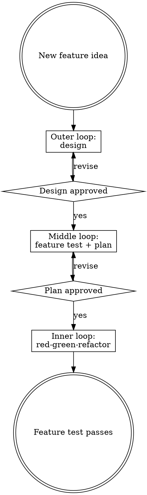

# Using Developer Skills

## Three-Loop Architecture

Developer work is organized into three nested loops. Each loop has its own skill. Invoke the skill for the loop you are currently in.

## Skill Routing Table

| Situation | Invoke |
|---|---|
| Starting a session for a new or in-progress feature | `developer:ailly` |
| Gathering and refining context for a vague new topic, with nothing written yet | `developer:research` |
| Exploring a new idea, clarifying requirements, and producing a formal design doc | `developer:design` |
| Writing the feature test (design approved, no test yet) | `developer:feature-test` |
| Breaking a failing feature test into implementation steps | `developer:plan` |
| Implementing a plan step with TDD | `developer:red-green-refactor` |
| Debugging a compiler error or test failure during TDD | `developer:thinking` |
| Cleaning up code after tests pass, before finishing | `developer:refactor` |
| Setting up a new project or language environment | `developer:initialize` |

## Draft Gates

The outer and middle loops produce `*Draft YYYY-MM-DD*` artifacts. A human must review and clear the draft marker before the next loop begins. `developer:ailly` enforces this. It will not proceed past a draft gate in the same session.

| Artifact | Location | Clears to enter |
|---|---|---|
| Research notes | `docs/developer/YYYY-MM-DD-A-<topic>/research.md` | Design phase |
| Design doc | `docs/developer/YYYY-MM-DD-A-<topic>/design.md` | Middle loop feature test |
| Feature test | `docs/developer/YYYY-MM-DD-A-<topic>/feature-test.md` | Planning implementation |
| Plan | `docs/developer/YYYY-MM-DD-A-<topic>/plan.md` | Inner loop red/green/refactor |