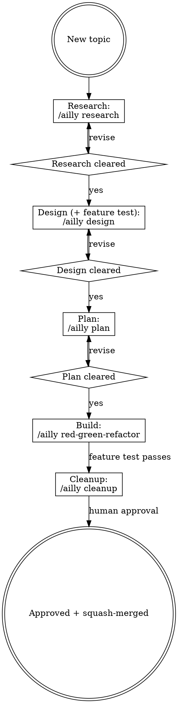
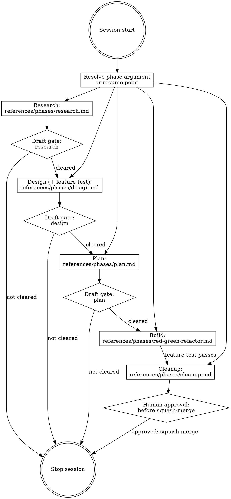

# Developer:ailly

## Overview

The developer skill package's bootstrap and session coordinator. It routes every developer task to the right ability, creates and manages the session folder, drives each of the five lifecycle phases, enforces draft gates, and determines where to resume when re-entering an existing session.

The five phases are **research**, **design**, **plan**, **red-green-refactor** (the Build phase), and **cleanup**. You enter them by argument, not by selecting a standalone skill. `/ailly design ...` runs the design phase. `/ailly` with no phase resumes the session at the correct phase (see Phase Argument and Resume). Each phase body lives in `developer/skills/ailly/references/phases/<phase>.md`. The coordinator never inlines all five phase bodies: it selects the one reference for the current phase and runs it through the active harness's isolation mechanism.

The other developer abilities are **thinking**, **refactor**, **initialize**, and the **program-management** pair. Like the phases, they are references the coordinator consults at the right moment, not separate skills (see Routing). The only other standalone developer skill is `developer:clean-comments-review`, a review specialist consumed by `general:review`.

**Announce at start:** "Using developer:ailly to coordinate this session." Load `general:using-general` concurrently with `developer:ailly`. If it is not already present in the session's context when Ailly loads, Ailly loads it immediately before doing anything else, not deferred or situational.

## Routing

Developer work runs through five phases: research, design, plan, build (red-green-refactor), and cleanup. Draft gates separate them for human review. The phases are **not standalone skills**. You enter them through this coordinator by phase argument. For example, `/ailly design ...` selects the matching `references/phases/<phase>.md` and runs it with phase isolation. See Phase Isolation for details. With no argument, the coordinator resumes at the correct phase.

The coordinator's other abilities are progressive references it consults when the situation calls for them, not phases and not separate skills:

| Situation | Route to |
|---|---|
| Starting a session for a new or in-progress feature (or resuming one) | this coordinator (`developer:ailly`, no argument resumes) |
| Gathering and refining context for a vague new topic, with nothing written yet | `/ailly research` → `references/phases/research.md` |
| Exploring a new idea and producing a formal design doc plus its one feature test | `/ailly design` → `references/phases/design.md` |
| Breaking a failing feature test into implementation steps | `/ailly plan` → `references/phases/plan.md` |
| Implementing a plan step with TDD | `/ailly red-green-refactor` → `references/phases/red-green-refactor.md` |
| Finishing the topic: final review, extract deferred tasks, prepare the squash-merge | `/ailly cleanup` → `references/phases/cleanup.md` |
| Surfacing intent-alignment questions against the original prompt at a draft gate | `references/abilities/intent-review.md` |
| Stuck on a red compiler/test/lint error during build, especially a recurring one after a fix | `references/abilities/thinking.md` (harness isolation path when available) |
| Your code passes all tests and you want to clean up before finishing | `references/abilities/refactor.md` |
| Setting up a new project or a language environment (layout, tooling, dev hooks) | `references/abilities/initialize.md` |
| Reading the next task from the tracker, or writing deferred work back during a session | `references/abilities/program-management/using.md` |
| Wiring Ailly to the team's issue tracker and document system (once per project) | `references/abilities/program-management/configuring.md` |

## Agent harness compatibility

Ailly's shared references use a canonical tool vocabulary. These tools include `Read`, `Edit`, `Bash`, `Task`, `Skill`, `TodoWrite`, and related names. This keeps the workflow stable across agent ecosystems. Before executing any instruction whose tool name differs in the active environment, consult `references/agents/<harness>.md`. The supported harness adapters are:

- `references/agents/claude.md` — Claude Code, where the canonical vocabulary is native.
- `references/agents/codex.md` — Codex tool and subagent mappings.
- `references/agents/copilot.md` — Copilot command-line tool and async-session mappings.
- `references/agents/gemini.md` — Gemini command-line tool and subagent mappings.

## Phase argument and resume

The phase is an argument to the coordinator. Five phase arguments are valid, mapping one-to-one to a phase reference:

| Phase argument | Phase reference |
|---|---|
| `research` | `references/phases/research.md` |
| `design` | `references/phases/design.md` |
| `plan` | `references/phases/plan.md` |
| `red-green-refactor` (Build) | `references/phases/red-green-refactor.md` |
| `cleanup` | `references/phases/cleanup.md` |

When invoked as `/ailly <phase> ...`, run that phase. When invoked with no phase argument, **determine the resume point** from the session folder (table below) and run that phase. Either way, the coordinator does not read all five phase references; it selects exactly one.

## Phase isolation

Run each phase with the strongest isolation mechanism the active harness provides:

1. The coordinator resolves the phase argument (or resume point) to its single `references/phases/<phase>.md`.
2. If the harness provides subagent isolation, it spawns a phase subagent and instructs that subagent to **read only that one phase reference** and execute it, passing the session folder path.
3. If the harness does not provide subagent isolation, follow its `references/agents/<harness>.md` fallback. The fallback still reads only the current phase reference before executing the phase.
4. The phase runner writes its artifact and returns control. It never reads the other four phase references.
5. Before any dispatch, the coordinator loads `general:dispatching-agents`'s model-selection reference as a mandatory precondition. Find this reference at `general/skills/dispatching-agents/model-selection.md`. This mandate applies to every subagent dispatch this skill package performs, unconditionally, not situationally. This is Ailly's own instance of the universal rule that Step 1 wires through `general:using-general`'s routing table. Any subagent dispatch in this repository, Ailly's or not, discovers the same mandate there.
6. Mandate-with-announce: if the active dispatch call exposes a parameter or field for the subagent's model, set it from that guidance. Either way, announce the model chosen to the developer.
7. This mandate reaches qualifying sub-steps that a phase reference's own body describes, not only the phase's top-level dispatch. Within a phase, a sub-step that clears `general:dispatching-agents`'s delegation signals must itself run through a subagent dispatch wherever the active harness provides subagent isolation, rather than performing it inline as a shortcut. A sub-step that fails those delegation signals stays inline, with no model-announcement obligation.

This preserves per-phase isolation while removing the five phase descriptions from the always-on Level-1 view. You reach the phases by argument and by reference, not as separate skills.

## Session folder

If it does not exist, create `.ailly/developer/YYYY-MM-DD-A-<topic>` where `A` is `A`, `B`, `C`, etc to manage multiple features started in the same day. If not already on a branch of the same name, suggest moving to that branch, and let the user make the switch. When the branch needs upstream changes, prefer a rebase and push with `--force-with-lease` rather than a plain force push.

If the folder already exists for the current topic, determine resume point:

| Files present | Draft marker cleared? | Resume at (phase reference) |
|---|---|---|
| No files | — | Research phase (`references/phases/research.md`) |
| `research.md` | No | Wait, ask user to clear the draft |
| `research.md` | Yes | Design phase (`references/phases/design.md`) |
| `design.md` | No | Wait, ask user to clear the draft |
| `design.md` | Yes | Plan phase (`references/phases/plan.md`) |
| `plan.md` | No | Wait, ask user to clear the draft |
| `plan.md` | Yes | Build (`references/phases/red-green-refactor.md`) |
| `plan.md` cleared, all steps done, feature test green | — | Cleanup phase (`references/phases/cleanup.md`) |

A file has its draft cleared when it no longer contains the `*Draft` marker.

Cleanup is the terminal phase: it runs the final review and extracts deferred decisions to `.ailly/developer/TASKS.md`. The coordinator, not cleanup, then **pauses for human approval before the squash-merge** or PR.

## Loop structure

## Draft gate enforcement

When first hitting a draft gate, perform a review using `references/abilities/intent-review.md` (a recommended, dismissible default) through the harness isolation path. Working backward from the original prompt through the accumulated artifacts, it notates probative intent questions in the session's `reviews/` folder. The human weighs these questions alongside their own draft-gate review. When requested, the session can use `general:conversation` to walk through the questions with the user.

After any research, design, or plan phase produces a draft, stop the session and tell the user:

> "This step is complete. Review `<path>`, make any changes, then remove the `*Draft YYYY-MM-DD*` marker from the top of the file. Intent review is at `<intent-review-path>`. Start a new session and run `developer:ailly` to continue."

**Do not proceed past a draft gate in the same session under any circumstances.** If the user asks to continue anyway, decline:

> "I can't continue past the draft gate in this session. The draft gate exists so you have a chance to review and refine before the next step builds on it."

## Phase Invocations

Pass the session folder path to each phase runner. The session folder is the single source of truth for all session artifacts. For each phase, use the active harness's isolation path and read only the matching phase reference:

- Research phase: `references/phases/research.md`
- Design phase: `references/phases/design.md`
- Plan phase: `references/phases/plan.md`
- Build phase: `references/phases/red-green-refactor.md` per plan step until the feature test passes
- Cleanup phase: `references/phases/cleanup.md`

## Phase-entry checks

Before running each phase, the coordinator checks before it proceeds and escalates to the human rather than silently working around a problem. Two checks share this discipline:

- **Model check.** Detect the running model and compare it to the model the guidance recommends for the dispatch about to happen. On a mismatch, say so explicitly. Set the model directly where the dispatch call provides a parameter for it, and announce the choice either way. This is a check, not a gate. The loop never stalls. Consult `general/skills/dispatching-agents/model-selection.md` for the selection principle, the complexity-dimension guidance, and the dated example table.
- **Tool readiness.** When a tool *declared for the project* fails, do not silently substitute another tool or work around it by hand. Consult `developer/skills/ailly/references/checks/tool-failure.md`. First check the initialize reference (`references/abilities/initialize.md`) for a local fix (for example, `mise trust`, `npm install`). Then escalate to the user with what failed, a suggested remediation, and why it is correct. Retry after the user remediates or grants permission.

## Topic slug

If the user's prompt doesn't make the topic slug obvious, ask for one before creating the session folder:

> "What's a short slug for this session? (for example, `user-auth`, `csv-export`)"

Use it to name the session folder: `.ailly/developer/YYYY-MM-DD-<topic>/`.

## Session artifacts

All artifacts for a session live under `.ailly/developer/YYYY-MM-DD-A-<topic>/`.

- `research.md` is the gathered and refined context for a topic.
- `design.md` is the overall design doc for a topic, including the path of its one feature test.
- `maps/<path>.md` contains the maps found during any forward/backward planning.
- `thinking/` is a scratch pad area for the `thinking` skill to share its findings with the calling agent.

## Quick-loop mode

Generally, be persistent in enforcing the draft structure. However, when first starting an Ailly task, the user may ask for a "quick loop." The same five phases (Research, Design, Plan, Build, Cleanup) still run, compressed:

- The draft gates **auto-clear**: each phase produces its artifact and the next phase begins in the same flow, without stopping for human review between them.
- Artifacts are **minimal**: just enough research, design, plan, and feature test to drive the work, not the full documents.
- The loop **churns straight to a green feature test**, then pauses before Cleanup so the user can review the intermediate session artifacts, including `research.md`, `design.md`, `plan.md`, `maps/`, and `thinking/`.
- During that review pause, do **not** run Cleanup, remove the session folder, or tidy away intermediate artifacts.
- If the user says **"no review"** when starting the quick loop, skip that post-green review pause and run Cleanup immediately.
- After the review pause, proceed to Cleanup only when the user asks to proceed, continue, finish, or run cleanup.
- Use the active harness's phase-isolation path for each phase of the loop, each reading only its one `references/phases/<phase>.md`.

**When it fits:** a small, unambiguous task with a narrow surface, where the cost of a wrong turn is low.

**What it trades away:** the human review beats. Skipping the gates means no chance to catch a wrong assumption before the next phase builds on it. Do not use quick-loop for ambiguous, high-blast-radius, or security-sensitive work.

**Review pause wording:** after the feature test passes, unless the quick loop started with "no review," tell the user:

> "Quick loop passes. Review the intermediate artifacts in `.ailly/developer/YYYY-MM-DD-A-<topic>/`, especially `thinking/` if it exists. When you're ready, ask to proceed and cleanup will run."

## Long-loop mode

When first starting an Ailly task, the user may ask to "run a long loop," a "dynamic workflow," or to "run <project> to completion." The same five phases (Research, Design, Plan, Build, Cleanup) still run through the active harness's phase-isolation path. At each draft gate, the coordinator does not stop for the human. Instead, it dispatches a research-and-decide reviewer through the harness isolation path. That reviewer reads the artifact cold, decides its open questions, records each decision with rationale in place, and clears the `*Draft*` marker. The run proceeds without the human wait while keeping the deliberation those gates exist for.

- Unlike quick-loop, the long loop does **not** inherit the forbidden list. Use it as the intended substitute precisely where you must forbid quick-loop. Apply it to ambiguous work, high-blast-radius decisions, and security-sensitive tasks while keeping full-fidelity artifacts and deliberation.
- The human merge gate and the Closing Bell are **never** auto-cleared by any reviewer.

See `developer/skills/ailly/references/shapes/long-loop.md` for the reviewer contract, the recording format, the escalation rule, the project-cycle interaction, and the end-of-run report.

## Bugfix shape

When requested, or when the research refine pass reclassifies the task as a bug, consult `developer/skills/ailly/references/shapes/bugfix.md`. The same five phases run, but the design specification uses "observed," "expected," and "unchanged" language. The feature test is a failing **reproduction** test that fills the same slot the design's feature test fills. You can do bugfixes with a quick loop in most cases.

## Project shape

Use the project shape when the topic is too large for one feature. Multiple features deliver value together as a unified whole. Consult `developer/skills/ailly/references/shapes/project/project-cycle.md`. The same five phases run at a larger scale. Each plan step has a dedicated development cycle. Mark sequential and parallel steps explicitly. The exit criterion is a Closing Bell usability study rather than one executable feature test. The documents are long-lived: they replicate to the organization's document repository on acceptance, and you mark them `completed: date` rather than deleting them at cleanup.

## Next task

Read `DEVELOPMENT.md` for a `## Program Management` section. Two coordinator references process the tracker, split bootstrap-vs-per-use:

- **One-time tracker setup** records the active tracker, the Epic/feature/bug term mapping, and the doc-system target. This is `references/abilities/program-management/configuring.md`. Run it once per project, never inside a development session.
- **Per-session task I/O** selects the next task, labels and links tasks, records phase progress, writes deferred work back, and publishes accepted Project docs. This is `references/abilities/program-management/using.md`. It runs every session against the contract the configuring reference recorded.

When you record an active tracker in `DEVELOPMENT.md`, defer next-task selection and deferred-work writing to `references/abilities/program-management/using.md`. The tracker is the source of truth for the task tier. When you configure no tracker, the section remains absent or the active tracker is `none`. Fall back to `TASKS.md` with today's behavior unchanged. Session artifacts remain **notes** in `.ailly/developer/<date>-<topic>/` either way.

When you finish a session, add the next step to `.ailly/developer/TASKS.md`. When calling run, read `TASKS.md` first. Then compare the user's input to the list of next steps. If the next step is obvious from context, run that. If there is no next step, start from the top. If the next step is ambiguous, ask whether they want to pick from a list or start a new developer task. When you start a task, remove it from `TASKS.md`. Ignore tasks in comments, either number sign lines or HTML section comments. When you need substantial context for a task, create a `TASK-NOTES-<task>.md` file with the details. Include just a short overview to that in the TASKS file. Review NOTES when you select the task.

When you finish a topic, run the cleanup phase (`references/phases/cleanup.md`) to leave things tidy.

## Attribution

When creating git commit messages, attribute yourself. Include `Co-Authored-By: "Ailly <developer@ailly.dev>"`.
