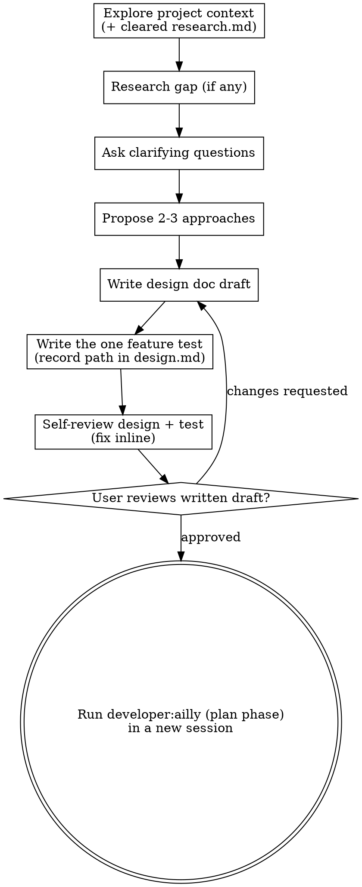

# Design phase

> Phase reference loaded by the coordinator (`developer:ailly`) when entered as
> `/ailly design ...`. The coordinator hands this to an isolated phase runner
> that reads only this one reference through the active harness's isolation path. There is no standalone `developer:design`
> skill; the coordinator enters the phase by argument.

## Overview

Facilitate turning ideas into fully formed designs and specs through natural collaborative dialogue, then capture the one feature test that defines "done" for the design.

Start by understanding the current project context, then ask questions one at a time to refine the idea. Once you understand what you're building, write the design draft, then collaborate with the user on the written draft. Focus the design on the problem and solution, stated from outside the code. Describe what the system does from the user's perspective; leave what it is made of for the plan. API designs may describe call shapes from the user's perspective in prose or pseudocode as the exception, but not implementation code. The single exception to the no-code rule is the feature test, which the design phase writes (see "The Feature Test").

**Trigger:** a cleared `research.md` in the session folder. Alternatively, your topic is clear enough that research added nothing to gather.

**Announce at start:** "Designing a feature to [summary of the prompt]. Per `general/skills/dispatching-agents/model-selection.md`, match the active provider with its effort qualifier verbatim. Set the model directly when the harness's dispatch call allows it; announce the model chosen either way. Continue on the current model either way."

## Anti-patterns

**"This Is Too Simple To Need A Design"**

Every project goes through this process. A todo list, a single-function utility, a config change—all of them. "Simple" projects are where unexamined assumptions cause the most wasted work. The design can be short (a few sentences for simple projects), but you MUST present it and get approval.

**""I can just write a little code to explore"**

Code must go through test driven development during the red-green-refactor skill. The design is only for preparing the user visible surface of the feature or task. You can read code to orient and clarify what features are already available, but you must not write new feature or implementation code at this step. The feature test is a narrow exception, but it's only runnable to show the journey hasn't landed yet, and involves no implementation of the feature itself.

## Design docs

A specification for how to develop a single module in a larger system. Should be one page for a typical small module, or five pages for a substantially larger ensemble module. Most design docs are for small modules; confirm before making a larger doc.

A design doc has these sections.

- **Purpose** of the problem this module solves.
- **Prior Art** of similar or suggestive components to learn from.
- **User Journey and Metrics** describing the user-visible flow and the measures that determine whether the deployed design operates within acceptable constraints.
- **Specification** of the technical details to implement, and the challenges to meet those constraints.
- **Alternatives** considered and why existing off-the-shelf tools are not suitable to this problem.
- **Summary** including any deferred technical decisions.
  - **Open Artifact Decisions** (optional subsection under Summary) naming any concrete artifact the design invents: a filename, schema, on-disk location, or record format that no skill template, project convention, or the cleared `research.md` prescribes. Omit this section or leave it empty when existing templates and conventions derive every artifact.

## The feature test

The design phase produces **one executable feature test** that encodes the primary user story end-to-end. This is the acceptance test that stays red until the feature is done. You write it here, alongside the design that motivates it, behind a single review gate.

**Hard gate:** write **only** the test. Do not write any implementation code, and do not scaffold project structure beyond the test file itself. Decline any request to implement in this session.

- Write the user story in plain language first (Given/When/Then or a short narrative).
- Write exactly one executable test that runs end-to-end through that story, at the integration/e2e level, asserting the user-story outcome directly. It fails at the start because no implementation exists.
- For user interfaces, use reasonable controls and interface elements that a user might expect. You may refine these in later passes, but a human must be able to read the unit test and perform its steps in the UI without using developer or debugging tools.
- Use the language and test framework established by the initialize reference (`references/abilities/initialize.md`), and place the test in the project test tree at that conventional location.
- Record the test's path in `design.md` so the plan phase can find it.

For complex UI features, Page Object abstractions are appropriate; for simple features, keep the test direct and flat. One test, not a suite of unit tests.

## Checklist

Create a task for each of these items and complete them in order:

1. **Explore project context** checking domain model, docs, files, and recent commits, plus the cleared `research.md`. If `research.md` has a **Libraries & Skills** section, **load every skill it names via the active harness's skill-loading mechanism before designing**. This ensures the design uses the framework's own idioms, not a from-scratch reinvention. Copy that load-skill directive forward into `design.md` so the plan and build phases honor it too.
2. **Research additional context** using `research` skills only if a gap remains after `research.md`.
3. **Ask clarifying questions** one at a time, to understand purpose, constraints, success criteria, and other salient details.
4. **Propose 2-3 approaches** with trade-offs and your recommendation.
5. **Write the design doc draft** directly, scaling each section to its complexity, saved to `.ailly/developer/YYYY-MM-DD-A-<topic>/design.md`. Write the whole draft; do not read it out section by section for approval first.
6. **Surface open artifact decisions.** For any concrete artifact choice not prescribed by a skill template, an existing project convention, or the cleared `research.md`, record it in an **Open Artifact Decisions** subsection under **Summary** in the draft. Do this before writing the feature test, since the test binds to the artifacts the draft settles.
7. **Write the feature test** in the project test tree, and record its path in `design.md` (see "The Feature Test").
8. **Review** the design doc and the feature test using the `general:review` skill, including the intent-review ability (a recommended, dismissible default) in `references/abilities/intent-review.md`. When preparing the general review rubric, additionally include checks for placeholders, contradictions, ambiguity, and scope.
9. **Collaborate on the written draft** — refer the user to the design, the test and the intent review, work through their edits on the written draft, and tell them how to begin the next phase in a new session. Stop at this point.

## Sub-dispatch

Per `developer/skills/ailly/SKILL.md`'s Phase Isolation mandate and delegation signals in `general/skills/dispatching-agents/SKILL.md`, two Checklist steps qualify for their own subagent dispatch rather than running inline. These are **Explore project context** (step 1) and **Propose 2-3 approaches** (step 4). Both are independently scoped with a clear input/output boundary and can proceed in parallel with other design work. Dispatch each through the harness's subagent mechanism wherever it is available, following the mandate-with-announce rule for the model.

The remaining steps stay inline, deliberately, not by omission. **Research additional context** (step 2) is conditional and tightly coupled to whatever gap step 1 surfaces. **Ask clarifying questions** (step 3) require synchronous, multi-turn exchange with the user that a subagent cannot hold. **Collaborate on the written draft** (step 9) also requires this synchronous exchange. **Write the design doc draft** (step 5) needs low-latency access to the context accumulated in-session. **Surface open artifact decisions** (step 6) and **Write the feature test** (step 7) also need this access. **Review** (step 8) already routes through the named `general:review` skill's own dispatch conventions, not through inline work this mandate targets.

## Process flow



**The terminal state is a completed design doc plus its one failing feature test.** Do NOT invoke any implementation skill. Once you clear the draft, run `developer:ailly` (resuming at the plan phase) in a new session.

## The process

**Understanding the idea:**

- Check out the current project state first (files, docs, recent commits) and the cleared `research.md`.
- Fill in only the context `research.md` did not already settle. If the requested API has a known missing feature, or a library already does this, surface it now.
- Before asking detailed questions, assess scope. If the request describes multiple independent subsystems, flag this immediately. For example, a request to "build a platform with chat, file storage, billing, and analytics" involves multiple independent systems. Don't spend questions refining details of a project that you need to decompose first.
- If the project is too large for a single spec, enable the user to decompose into smaller modules: what are the independent pieces, how do they relate, what order should they be built? Then brainstorm the first module through the normal design flow. Each further module gets its own design → plan → implementation cycle; record this in `.ailly/developer/YYYY-MM-DD-A-<topic>/TODO.md`.
- For appropriately scoped projects, ask questions one at a time to refine the idea.
- Present summaries of research results with links to sources to justify options.
- Prefer multiple choice questions when possible, with room for open ended responses.
- Only one question per message. If a topic needs more exploration, break it into multiple questions.
- Focus on understanding: purpose, constraints, success criteria.

**Exploring approaches:**

- Propose 2-3 different approaches with trade-offs.
- Present options directly with your recommendation and reasoning. Lead with your recommended option and explain why. Include pros and cons of each.
- For each approach, use forward-backward planning to map the path from the current state to the proposed end state. Work backward from where the approach lands and forward from where the codebase is now, meeting in the middle. This surfaces whether an approach is feasibly reachable and where the hard steps are before committing to it. See `developer/skills/ailly/references/abilities/forward-backward.md`.

**Writing the design:**

- Once you believe you understand what you're building, write the full design draft directly. Do not read it out section by section for approval before writing it.
- At this stage, the design covers the user-visible side, without proposing implementation code. The feature test is the one exception, written right after the design draft.
- Scale each section to its complexity: a few sentences if straightforward, up to 200-300 words if nuanced.
- Cover user workflows, failure modes, and automated & manual verification steps.
- Write the whole draft, then surface open artifact decisions, then write the feature test that encodes its primary user story.
- Surface an artifact choice in an **Open Artifact Decisions** subsection under **Summary** when it is not:
  - prescribed by a skill template (a test path following the framework's convention),
  - established by project convention (a manifest or config schema already in use), or
  - resolved in the cleared `research.md`.
  Otherwise templates and conventions derive the choice; state it as a conclusion where it belongs, not in this subsection. Use this entry format:

  ```text
  **<artifact name/path>:** <the choice and its options>.
  Proposed: <the design's recommendation>.
  ```

- Then collaborate with the user on the written draft, revising it in place from their feedback rather than gating each section before you write it.

**Working in existing codebases:**

- Explore the current structure before proposing changes. Follow existing patterns. Use LSP connections to follow code references.
- Don't propose unrelated refactoring. Stay focused on what serves the current goal.
- Where existing code has problems that affect the work, suggest these refactorings as follow up tasks. Examples include a file that has grown too large, unclear boundaries, or tangled responsibilities.

## Bugfix shape

When the research refine pass sized the task as a bug, smaller than a feature or a project, consult `developer/skills/ailly/references/shapes/bugfix.md`. The design content uses observed / expected / unchanged language, and the feature test is a failing **reproduction** test that fills the same slot the feature test otherwise fills.

## After the design

Write the validated design to `.ailly/developer/YYYY-MM-DD-A-<topic>/design.md`. Include `*Draft YYYY-MM-DD*` at the beginning of the document, after the title. A human removes the `*Draft*` mark when the design and its feature test are ready. Write the feature test to the project test tree and record its path in `design.md`. Invoke the `general:review` skill on both.

**User Review Gate:**
After the review loop passes, ask the user to review the written design and feature test before proceeding.

> "The design is at `<path>/design.md` and the feature test is at `<test-file-path>`. Please make any further modifications you find appropriate. Pay special attention to any **Open Artifact Decisions** subsection under Summary. These are artifact choices (filenames, formats, locations) the design does not prescribe elsewhere. Confirm they fit your intent before clearing the draft. When you're satisfied, end this session, remove the `*Draft*` marker from `design.md`, and run `developer:ailly` (it resumes at the plan phase) in a new session to continue."

Wait for the user's response. If they request changes, make them and re-run the review loop. Stop once the user approves. Do not continue to any implementation skill in this prompt. Politely decline any such requests.
