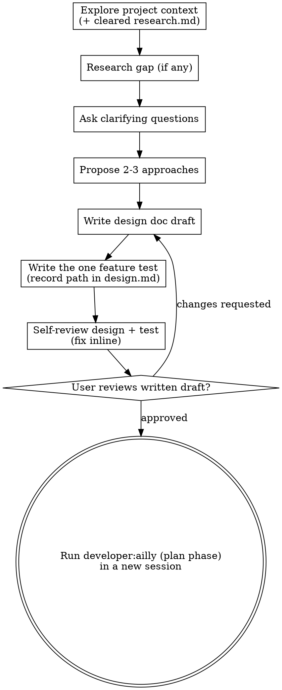

# Design Phase

> Phase reference loaded by the coordinator (`developer:ailly`) when entered as
> `/ailly design ...`. The coordinator hands this to an isolated phase subagent
> that reads only this one reference. There is no standalone `developer:design`
> skill; the phase is entered by argument.

## Overview

Help turn ideas into fully formed designs and specs through natural collaborative dialogue, then capture the one feature test that defines "done" for the design.

Start by understanding the current project context, then ask questions one at a time to refine the idea. Once you understand what you're building, write the design draft, then collaborate with the user on the written draft. Focus the design on the problem and solution, stated from outside the code. Describe what the system does from the user's perspective; leave what it is made of for the plan. API designs may describe call shapes from the user's perspective in prose or pseudocode as the exception, but not implementation code. The single exception to the no-code rule is the feature test, which the design phase writes (see "The Feature Test").

**Trigger:** A cleared `research.md` in the session folder (or a topic clear enough that research added nothing to gather).

**Announce at start:** "Designing a feature to [summary of the prompt]. Name the recommended model for design from the Phase by Provider table in developer/skills/ailly/references/checks/model-per-phase.md, matched to the active provider, with its effort qualifier verbatim. If you're not already on it, I'll switch when the harness allows; otherwise switch with `/model` (press `s` for session-only) as the fallback. I'll continue on the current model either way."

## Anti-Patterns

**"This Is Too Simple To Need A Design"**

Every project goes through this process. A todo list, a single-function utility, a config change — all of them. "Simple" projects are where unexamined assumptions cause the most wasted work. The design can be short (a few sentences for truly simple projects), but you MUST present it and get approval.

**""I can just write a little code to explore"**

Code must go through test driven development during the red-green-refactor skill. The design is only for preparing the user visible surface of the feature or task. Reading code is allowed to orient and clarify what features are already available, but you must not write new feature or implementation code at this step. The feature test is a narrow exception, but it's only runnable to show the journey hasn't landed yet, and involves no implementation of the feature itself.

## Design Docs

A specification for how to develop a single component in a larger system. Should be one page for a typical small component, or five pages for a substantially larger ensemble component. Most design docs are for small components; confirm before making a larger doc.

A design doc has these sections.

- **Purpose** of the problem this component will solve.
- **Prior Art** of similar or suggestive components to learn from.
- **User Journey and Metrics** describing the user-visible flow and the measures that determine whether the deployed design operates within acceptable constraints.
- **Specification** of the technical details to implement, and the challenges to meet those constraints.
- **Alternatives** considered and why existing off-the-shelf tools are not suitable to this problem.
- **Summary** including any deferred technical decisions.

## The Feature Test

The design phase produces **one executable feature test** that encodes the primary user story end-to-end. This is the acceptance test that stays red until the feature is done. It is written here, alongside the design that motivates it, behind a single review gate.

**Hard gate:** Write **only** the test. Do not write any implementation code, and do not scaffold project structure beyond the test file itself. Decline any request to implement in this session.

- Write the user story in plain language first (Given/When/Then or a short narrative).
- Write exactly one executable test that runs end-to-end through that story, at the integration/e2e level, asserting the user-story outcome directly. It fails at the start because no implementation exists.
- Use the language and test framework established by the initialize reference (`references/abilities/initialize.md`), and place the test in the project test tree at that conventional location.
- Record the test's path in `design.md` so the plan phase can find it.

For complex UI features, Page Object abstractions are appropriate; for simple features, keep the test direct and flat. One test, not a suite of unit tests.

## Checklist

Create a task for each of these items and complete them in order:

1. **Explore project context** checking domain model, docs, files, and recent commits, plus the cleared `research.md`. If `research.md` has a **Libraries & Skills** section, **load every skill it names via the Skill tool before designing** (so the design uses the framework's own idioms, not a from-scratch reinvention), and copy that load-skill directive forward into `design.md` so the plan and build phases honor it too.
2. **Research additional context** using `research` skills only if a gap remains after `research.md`.
3. **Ask clarifying questions** one at a time, to understand purpose, constraints, success criteria, and other salient details.
4. **Propose 2-3 approaches** with trade-offs and your recommendation.
5. **Write the design doc draft** directly, scaling each section to its complexity, saved to `.ailly/developer/YYYY-MM-DD-A-<topic>/design.md`. Write the whole draft; do not read it out section by section for approval first.
6. **Write the feature test** in the project test tree, and record its path in `design.md` (see "The Feature Test").
7. **Review** the design doc and the feature test using the `general:review` skill. When preparing the rubric, additionally include checks for placeholders, contradictions, ambiguity, and scope.
8. **Collaborate on the written draft** — refer the user to the design and the test, work through their edits on the written draft, and tell them how to begin the next phase in a new session. Stop at this point.

## Process Flow

**The terminal state is a completed design doc plus its one failing feature test.** Do NOT invoke any implementation skill. The user will run `developer:ailly` (resuming at the plan phase) in a new session once the draft is cleared.

## The Process

**Understanding the idea:**

- Check out the current project state first (files, docs, recent commits) and the cleared `research.md`.
- Fill in only the context `research.md` did not already settle. If the requested API has a known missing feature, or a library already does this, surface it now.
- Before asking detailed questions, assess scope: if the request describes multiple independent subsystems (e.g., "build a platform with chat, file storage, billing, and analytics"), flag this immediately. Don't spend questions refining details of a project that needs to be decomposed first.
- If the project is too large for a single spec, help the user decompose into smaller components: what are the independent pieces, how do they relate, what order should they be built? Then brainstorm the first component through the normal design flow. Each further component gets its own design → plan → implementation cycle; record this in `.ailly/developer/YYYY-MM-DD-A-<topic>/TODO.md`.
- For appropriately-scoped projects, ask questions one at a time to refine the idea.
- Present summaries of research results with links to sources to justify options.
- Prefer multiple choice questions when possible, with room for open ended responses.
- Only one question per message. If a topic needs more exploration, break it into multiple questions.
- Focus on understanding: purpose, constraints, success criteria.

**Exploring approaches:**

- Propose 2-3 different approaches with trade-offs.
- Present options directly with your recommendation and reasoning. Lead with your recommended option and explain why. Include pros and cons of each.
- For each approach, use forward-backward planning to map the path from the current state to the proposed end state. Work backward from where the approach lands and forward from where the codebase is now, meeting in the middle. This surfaces whether an approach is feasibly reachable and where the hard steps are before committing to it. See `developer/skills/ailly/references/abilities/forward-backward.md`.

**Writing the design:**

- Once you believe you understand what you're building, write the full design draft directly. Do not read it out section by section for approval before writing it.
- At this stage, the design covers the user-visible side, without proposing implementation code (the feature test is the one exception, written right after the design draft).
- Scale each section to its complexity: a few sentences if straightforward, up to 200-300 words if nuanced.
- Cover user workflows, failure modes, and automated & manual verification steps.
- Write the whole draft, then write the feature test that encodes its primary user story.
- Then collaborate with the user on the written draft, revising it in place from their feedback rather than gating each section before it is written.

**Working in existing codebases:**

- Explore the current structure before proposing changes. Follow existing patterns. Use LSP connections to follow code references.
- Don't propose unrelated refactoring. Stay focused on what serves the current goal.
- Where existing code has problems that affect the work (e.g., a file that's grown too large, unclear boundaries, tangled responsibilities), suggest these refactorings as follow up tasks.

## Bugfix Shape

When the research refine pass sized the task as a bug, smaller than a feature or a project, consult `developer/skills/ailly/references/shapes/bugfix.md`. The design content uses observed / expected / unchanged language, and the feature test is a failing **reproduction** test that fills the same slot the feature test otherwise fills.

## After the Design

Write the validated design to `.ailly/developer/YYYY-MM-DD-A-<topic>/design.md`. Include `*Draft YYYY-MM-DD*` at the beginning of the document, after the title. A human will remove the `*Draft*` mark when the design and its feature test are ready. Write the feature test to the project test tree and record its path in `design.md`. Invoke the `general:review` skill on both.

**User Review Gate:**
After the review loop passes, ask the user to review the written design and feature test before proceeding.

> "The design is at `<path>/design.md` and the feature test is at `<test-file-path>`. Please make any further modifications you find appropriate. When you're satisfied, end this session, remove the `*Draft*` marker from `design.md`, and run `developer:ailly` (it resumes at the plan phase) in a new session to continue."

Wait for the user's response. If they request changes, make them and re-run the review loop. Stop once the user approves. Do not continue to any implementation skill in this prompt. Politely decline any such requests.
