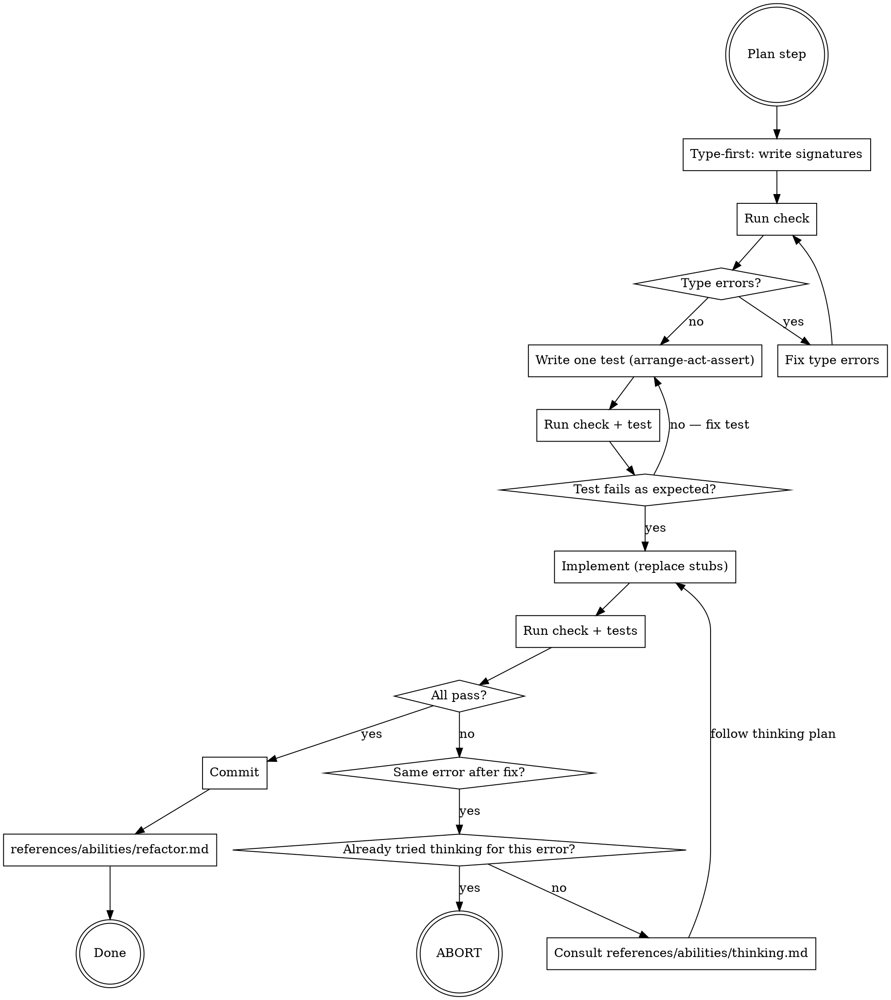

# Build phase (red-green-refactor)

> Phase reference loaded by the coordinator (`developer:ailly`) when you invoke it as
> `/ailly red-green-refactor ...` (the Build phase). The coordinator hands this to
> an isolated phase runner that reads only this one reference through the active harness's isolation path. There is no
> standalone `developer:red-green-refactor` skill; you enter the phase by argument.

## Overview

The innermost development loop. Type-first TDD: write signatures before tests, tests before implementation, commit before refactoring. Has an explicit exit condition to prevent infinite loops.

**Announce at start:** "[Summary of the plan step.] Using the developer:ailly Build phase (red-green-refactor) for this step of the plan. Per `general/skills/dispatching-agents/model-selection.md`, match to the active provider with its effort or context qualifier verbatim. Set the model directly when the harness's dispatch call allows it, and announce the model chosen either way. I'll continue on the current model either way."

## Before the loop: load framework skills

If `plan.md` (or the design it came from) carries a **Libraries & Skills** directive, load every skill it names via the active harness's skill-loading mechanism before writing any signatures. Load these skills here to ensure your implementation leverages the framework's idioms instead of reinventing what the library already provides.

## The loop

## Type-first

Write class/function/method signatures with stub bodies before writing any tests:

- Rust: `todo!()`
- Python: `...` or `raise NotImplementedError` or `return ""` (or appropriate default)
- TypeScript: `throw new Error("not implemented")` or `return "";` (or appropriate default)

Run check. Fix all type errors before writing any tests. A clean type check means the API contract is coherent.

## Test: arrange-act-assert

Add one test per iteration using the arrange-act-assert pattern. See `patterns:using-patterns` and `references/patterns/arrange-act-assert.md` for details. The test should:
- Target one behavior of the current plan step
- Fail for the right reason (the implementation is a stub, not a type error)
- Triangulate implementation and edge cases following the triangulate pattern (see `patterns:using-patterns` and `references/patterns/triangulate.md`)

Run check, then run tests. Confirm the test fails as expected.

The plan includes happy path tests. While the user reviewed and approved them, do not treat those as sacrosanct, but do treat them as informative. You can modify it to better fit the realities of your implementation.

Similarly, the user reviewed the implementation sketch as a reasonable direction for the feature. Start from there, but be flexible in iterating out both for initial correctness and a hardened, safe implementation.

## Implement

Replace stub bodies with real code. Run check, then run tests. Repeat until all tests pass and the feature test is passing up to the point expected by the current plan step. Modify doc comments as needed.

## Thinking trigger

Consult `references/abilities/thinking.md` through the active harness's isolation path when:
- The same error (or substantially the same) appears after you intended a change to fix it.
- An error appears that you did not cause through code changes in this step

Pass to the thinking runner:
- The exact error message
- The code added or changed in this step
- The plan step you are implementing

## Loop abort

If you have already consulted `references/abilities/thinking.md` for the current error and the same or equivalent error reappears after following its plan, do **not** consult it again. Stop immediately and report:

> "Stuck on the same error after thinking. Error: `<error>`. Thinking doc at `.ailly/developer/YYYY-MM-DD-A-<topic>/thinking/<problem>.md`. Suggestion: review the current diff (`git diff`) or restore the working directory (`git restore .`) and try again."

Do not loop. Do not try a different approach on your own. Abort and report.

## Commit

When all tests pass:
1. `git add` only the files changed in this step.
2. Commit with a message describing what the step implemented.
3. Consult `references/abilities/refactor.md`.
4. Commit with a message describing the refactorings.
