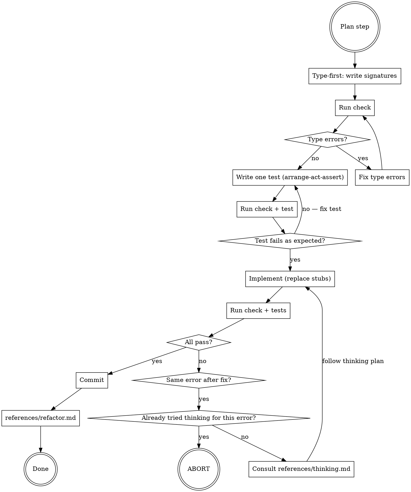

# Build Phase (Red-Green-Refactor)

> Phase reference loaded by the coordinator (`developer:ailly`) when entered as
> `/ailly red-green-refactor ...` (the Build phase). The coordinator hands this to
> an isolated phase subagent that reads only this one reference. There is no
> standalone `developer:red-green-refactor` skill; the phase is entered by argument.

## Overview

The innermost development loop. Type-first TDD: write signatures before tests, tests before implementation, commit before refactoring. Has an explicit abort condition to prevent infinite loops.

**Announce at start:** "[Summary of the plan step.] Using the developer:ailly Build phase (red-green-refactor) for this step of the plan. Name the recommended model for implementation from the Phase by Provider table in developer/references/model-per-phase.md, matched to the active provider, with its effort or context qualifier verbatim. If you're not already on it, I'll switch when the harness allows; otherwise switch with `/model` (press `s` for session-only) as the fallback. I'll continue on the current model either way."

## The Loop

## Type-First

Write class/function/method signatures with stub bodies before writing any tests:

- Rust: `todo!()`
- Python: `...` or `raise NotImplementedError` or `return ""` (or appropriate default)
- TypeScript: `throw new Error("not implemented")` or `return "";` (or appropriate default)

Run check. Fix all type errors before writing any tests. A clean type check means the API contract is coherent.

## Test: Arrange-Act-Assert

Add one test per iteration using the arrange-act-assert pattern (`patterns:using-patterns`, `references/patterns/arrange-act-assert.md`). The test should:
- Target one behavior of the current plan step
- Fail for the right reason (the implementation is a stub, not a type error)
- Triangulate implementation and edge cases, following the triangulate pattern (`patterns:using-patterns`, `references/patterns/triangulate.md`)

Run check, then run tests. Confirm the test fails as expected.

The plan includes happy path tests. While they has been reviewed and approved by the user, do not treat those as sacrosanct, but do treat them as informative. It can be modified to better fit the realities of your implementation.

Similarly, the implementation sketch has been reviewed by the user as a reasonable direction for the feature. Start from there, but be flexible in iterating out both for initial correctness and a hardened, safe implementation.

## Implement

Replace stub bodies with real code. Run check, then run tests. Repeat until all tests pass and the feature test is passing up to the point expected by the current plan step. Modify doc comments as needed.

## Thinking Trigger

Consult `references/thinking.md` (as a subagent) when:
- The same error (or substantially the same) appears after a change was intended to fix it.
- An error appears that is unrelated to the code added or changed in this step

Pass to the thinking subagent:
- The exact error message
- The code added or changed in this step
- The plan step being implemented

## Loop Abort

If `references/thinking.md` has already been consulted for the current error and the same or equivalent error reappears after following its plan, do **not** consult it again. Stop immediately and report:

> "Stuck on the same error after thinking. Error: `<error>`. Thinking doc at `.ailly/developer/YYYY-MM-DD-A-<topic>/thinking/<problem>.md`. Suggestion: review the current diff (`git diff`) or restore the working directory (`git restore .`) and try again."

Do not loop. Do not try a different approach on your own. Abort and report.

## Commit

When all tests are green:
1. `git add` only the files changed in this step.
2. Commit with a message describing what the step implemented.
3. Consult `references/refactor.md`.
4. Commit with a message describing the refactorings.