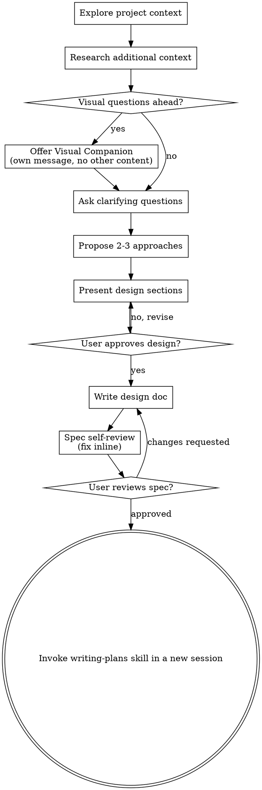

# Brainstorming Ideas Into Designs

Help turn ideas into fully formed designs and specs through natural collaborative dialogue.

Start by understanding the current project context, then ask questions one at a time to refine the idea. Once you understand what you're building, present the design and get user approval. Include code for pertinent public API changes, but focus the design on the problem and solution. Do not include code for specific implementations at this time.

## Anti-Pattern: "This Is Too Simple To Need A Design"

Every project goes through this process. A todo list, a single-function utility, a config change — all of them. "Simple" projects are where unexamined assumptions cause the most wasted work. The design can be short (a few sentences for truly simple projects), but you MUST present it and get approval.

## Design Docs

A specification for how to develop a single component in a larger system. Should be one page for a typical small component, or five pages for a substantially larger ensemble component. Most design docs are for small components; confirm before making a larger doc.

A design doc has these sections.

- **Problem Statement** of the problem this component will solve.
- **Prior Art** of similar or suggestive components to learn from.
- **Metrics** that determine whether the deployed design is operating within acceptable constraints.
- **Specification** of the technical details to implement, and the challenges to meet those constraints.
- **Alternatives** considered and why existing off-the-shelf tools are not suitable to this problem.
- **Summary** including any deferred technical decisions.

## Checklist

Create a task for each of these items and complete them in order:

1. **Explore project context** checking domain model, docs, files, and recent commits.
2. **Research additional context** using `research` skills.
3. **Offer visual companion** (if topic will involve visual questions) separately from clarifying questions. See the Visual Companion section below.
4. **Ask clarifying questions** one at a time, to understand purpose, constraints, success criteria, and other salient details.
5. **Propose 2-3 approaches** with trade-offs and your recommendation.
6. **Present design** in sections scaled to their complexity, getting user approval after each section.
7. **Write design doc** saved to `docs/developer/design/YYYY-MM-DD-A-<topic>.md`.
8. **Review** that design doc, using the `general:review` skill. When preparing the rubric, additionally include checks for placeholders, contradictions, ambiguity, and scope.
9. **User reviews draft** — refer the user to the design, ask them to provide their edits, and tell them how to begin the next phase in a new session. Stop at this point.

## Process Flow

**The terminal state is a completed design doc.** Do NOT invoke frontend-design, mcp-builder, or any other implementation skill. The user will invoke writing-plans in a new session.

## The Process

**Understanding the idea:**

- Check out the current project state first (files, docs, recent commits).
- Perform web searches to fill in additional context. Perhaps the requested API has a known missing feature that would increase the complexity of the design. Or there's a library that already does this feature, and it would be faster to pull that instead.
- Before asking detailed questions, assess scope: if the request describes multiple independent subsystems (e.g., "build a platform with chat, file storage, billing, and analytics"), flag this immediately. Don't do research or spend questions refining details of a project that needs to be decomposed first.
- If the project is too large for a single spec, help the user decompose into smaller components: what are the independent pieces, how do they relate, what order should they be built? Then brainstorm the first component through the normal design flow. Each further component gets its own spec → plan → implementation cycle, record this in `docs/developer/YYYY-MM-DD-A-/TODO.md`.
- For appropriately-scoped projects, ask questions one at a time to refine the idea
- Present summaries of research results with links to sources to justify options
- Prefer multiple choice questions when possible, but open-ended is fine too
- Only one question per message - if a topic needs more exploration, break it into multiple questions
- Focus on understanding: purpose, constraints, success criteria

**Exploring approaches:**

- Propose 2-3 different approaches with trade-offs
- Present options directly with your recommendation and reasoning
- Lead with your recommended option and explain why
- Include pros and cons of each approach
- For each approach, use forward-backward planning to map the path from the current state to the proposed end state. Work backward from where the approach lands and forward from where the codebase is now, meeting in the middle. This surfaces whether an approach is feasibly reachable and where the hard steps are before committing to it. See `developer/references/forward_backward.md`.

**Presenting the design:**

- Once you believe you understand what you're building, present the design
- Scale each section to its complexity: a few sentences if straightforward, up to 200-300 words if nuanced
- Ask after each section whether it looks right so far
- Cover: architecture, components, data flow, error handling, testing
- Be ready to go back and clarify if something doesn't make sense

**Design for isolation and clarity:**

- Break the system into smaller units that each have one clear purpose, communicate through well-defined interfaces, and can be understood and tested independently
- For each unit, you should be able to answer: what does it do, how do you use it, and what does it depend on?
- Can someone understand what a unit does without reading its internals? Can you change the internals without breaking consumers? If not, the boundaries need work.
- Smaller, well-bounded units are also easier for you to work with - you reason better about code you can hold in context at once, and your edits are more reliable when files are focused. When a file grows large, that's often a signal that it's doing too much.

**Working in existing codebases:**

- Explore the current structure before proposing changes. Follow existing patterns.
- Where existing code has problems that affect the work (e.g., a file that's grown too large, unclear boundaries, tangled responsibilities), include targeted improvements as part of the design — the way a good developer improves code they're working in.
- Don't propose unrelated refactoring. Stay focused on what serves the current goal.

## After the Design

Write the validated design to `docs/developer/YYYY-MM-DD-A-<topic>/design.md`. Include `*DRAFT YYYY-MM-DD*` at the beginning of the document, after the title. A human will remove the `*DRAFT*` mark when the design is ready. Invoke the `general:review` skill on this document.

**User Review Gate:**
After the spec review loop passes, ask the user to review the written spec before proceeding.

> "The spec for this design is at `<path>`. Please make any further modifications you find appropriate. When you're satisfied, end this session. Remove the `*DRAFT*` tag, and use the writing-specs skill in a new session to continue."

Wait for the user's response. If they request changes, make them and re-run the spec review loop. Stop once the user approves. Do not continue to any implementation skill in this prompt. Politely decline any such requests.

**Implementation:**

- Do NOT invoke any other skill.
- writing-plans is the next step.
- The user will invoke that in a new session.

## Key Principles

- **YAGNI ruthlessly** — Remove unnecessary features from all designs
- **Explore alternatives** — Always propose 2-3 approaches before settling
- **Incremental validation** — Present design sections, get approval before moving on
- **Be flexible** — Go back and clarify when something doesn't make sense