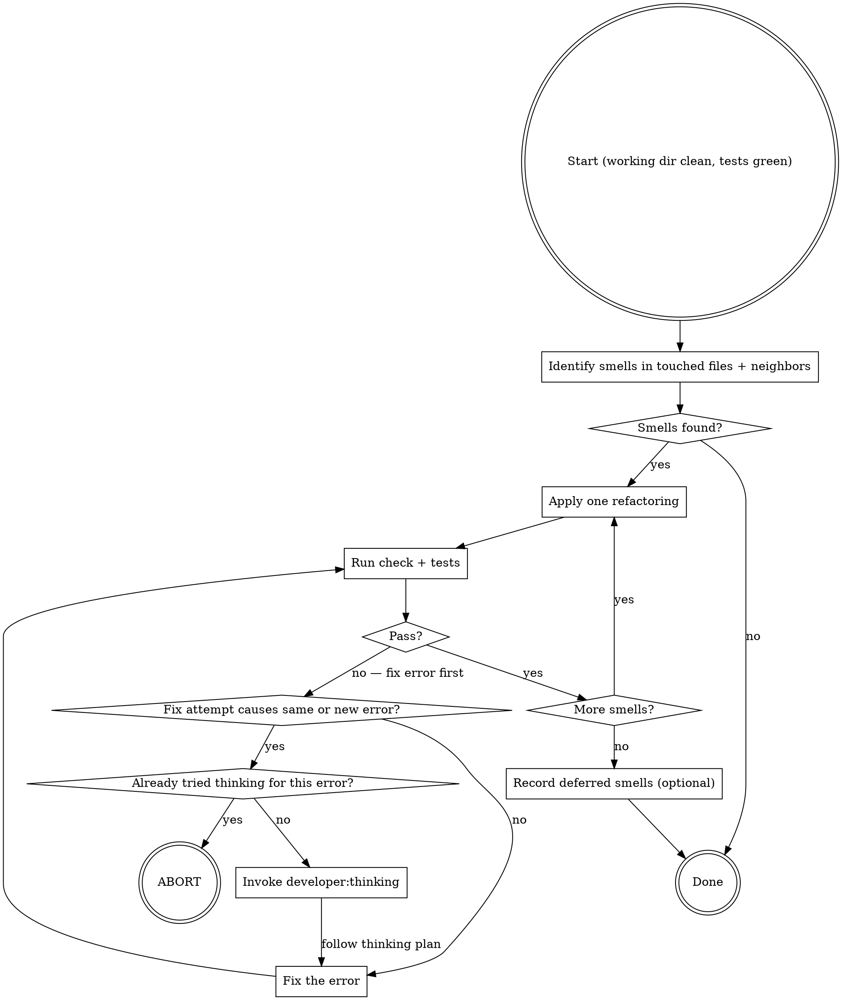

# developer:refactor

## Overview

Post-green cleanup. Runs only when tests are green and the working directory is clean. Applies one refactoring at a time, verifying after each. Stops when the smell is gone — not when the code is maximally elegant.

**Guard:** Check `git status` before starting. If the working directory is not clean, abort immediately:

> "Working directory is not clean. Please commit or stash your changes, then restart the refactoring step."

**Constraint:** Never refactor behavior and structure simultaneously. If any check or test fails during refactoring, fix the code first, then restart the refactoring step.

## Behavior

1. Identify code smells in files touched in this loop and their logical neighbors. Use `git diff --name-only HEAD` to enumerate files changed since the last commit.
2. Write a refactoring plan to `docs/developer/YYYY-MM-DD-A-<topic>/refactor-plan.md`. Include one checkbox per refactoring: smell name, file and line range, intended resolution. Cross out each item as it is completed.
3. Apply each refactoring one at a time. After each: run check, run tests. Abort on repeated errors (see below).
4. If after refactoring the tests pass, but the smell lingers, that's OK. It will still be there the next time someone has time to refactor.
5. Record deferred smells if any remain (optional).

## Code Smells to Target

Code smells are patterns for applying refactoring.

### Code Smells Within Classes

- **Three-Strikes Refactor** Duplicated code is an aroma, but has its place. Triplicate code is a smell. If you wait until you have three use cases, each might be slightly different, and it gives you a better view for what the common functionality is. If you refactor too early, you may find that the third use case doesn’t quite fit with your refactored code.
- **Comments** There’s a fine line between comments that illuminate and comments that obscure. Are the comments necessary? Do they explain “why” and not “what”? Can you refactor the code so the comments aren’t required? And remember, you’re writing comments for people, not machines.
- **Conditional Complexity** Watch out for large conditional logic blocks, particularly blocks that tend to grow larger or change significantly over time. Consider alternative object-oriented approaches such as decorator, strategy, or type state.
- **Combinatorial Explosion** You have lots of code that does almost the same thing... but with tiny variations in data or behavior. This can be difficult to refactor – perhaps using generics or an interpreter?
- **Temporary Field** Watch out for objects that contain a lot of optional or unnecessary fields. If you’re passing an object as a parameter to a method, make sure that you’re using all of it and not cherry-picking single fields. Use `patterns:domain-objects`.

- **Long Method** All other things being equal, a shorter method is easier to read, easier to understand, and easier to troubleshoot. Refactor long methods into smaller methods if you can.
- **Long Parameter List** The more parameters a method has, the more complex it is. Limit the number of parameters you need in a given method, or use an object to combine the parameters.
- **Large Class** Large classes, like long methods, are difficult to read, understand, and troubleshoot. Does the class contain too many responsibilities? Can the large class be restructured or broken into smaller classes?

- **Magic Constants** Avoid leaving constant, non-default primitive values in code. If a certain value must hold a string of a certain format, or a certain byte pattern has meaning, store it as a constant. Reference the constant whenever possible. However, format strings are not magic constants, as they have no shared meaning.
- **Type Embedded in Name** Avoid placing types in method names; it’s not only redundant, but it forces you to change the name if the type changes.
- **Uncommunicative Name** Does the name of the method succinctly describe what that method does? Could you read the method’s name to another developer and have them explain to you what it does? If not, rename it or rewrite it.
- **Inconsistent Names** Pick a set of standard terminology and stick to it throughout your methods. For example, if you have Open(), you should probably have Close(). Drive the names from `domain:glossary`.

- **Dead Code** Ruthlessly delete code that isn’t being used. That’s why we have source control systems! Use code coverage reports to identify unused and untested code.

### Code Smells Between Classes

- **Alternative Classes with Different Interfaces** If two classes are similar on the inside, but different on the outside, perhaps they can be modified to share a common interface.
- **Primitive Obsession** Apply `patterns:newtype` instead of using primitive types at API boundaries. Primitives are perfectly fine within a method or function.

- **Data Clumps** If you always see the same data hanging around together, maybe it belongs together. Consider rolling the related data up into a larger class.
- **Inheritance** Prefer composition to inheritance.
- **Message Chains** Watch out for long sequences of method calls or temporary variables to get routine data. Intermediaries are dependencies in disguise. 
- **Parallel Inheritance Hierarchies** Every time you make a subclass of one class, you must also make a subclass of another. Consider folding the hierarchy into a single class.
- **Incomplete Library Class** We need a method that’s missing from the library, but we’re unwilling or unable to change the library to include the method. The method ends up tacked on to some other class. If you can’t modify the library, consider isolating the method.

- **Inappropriate Intimacy** Watch out for classes that spend too much time together, or classes that interface in inappropriate ways. Classes should know as little as possible about each other.
- **Middle Man** If a class is delegating all its work, why does it exist? Cut out the middleman. Beware classes that are merely wrappers over other classes or existing functionality in the framework.
- **Indecent Exposure** Beware of classes that unnecessarily expose their internals. Aggressively refactor classes to minimize their public surface. You should have a compelling reason for every item you make public. If you don’t, hide it.
- **Feature Envy** Methods that make extensive use of another class may belong in another class. Consider moving this method to the class it is so envious of.
- **Lazy Class** Classes should pull their weight. Every additional class increases the complexity of a project. If you have a class that isn’t doing enough to pay for itself, can it be collapsed or combined into another class?

- **Divergent Change** If, over time, you make changes to a class that touch completely different parts of the class, it may contain too much unrelated functionality. Consider isolating the parts that changed in another class.
- **Shotgun Surgery** If a change in one class requires cascading changes in several related classes, consider refactoring so that the changes are limited to a single class.
- **Solution Sprawl** If it takes five classes to do anything useful, you might have solution sprawl. Consider simplifying and consolidating your design.

## Refactoring Loop



## Thinking Trigger

Invoke `developer:thinking` when a refactoring causes a failure and a fix attempt produces the same or a new error. Pass to the subagent: the exact error message, the refactoring applied, and the smell being addressed.

If `developer:thinking` has already been invoked for this error and the same error reappears after following its plan, do **not** invoke it again! Instead, revert the changes and mark this refactoring as deferred.

## Deferred Smells

If smells remain that are too risky to address now (e.g., would require changing multiple modules, or encountered repeated failures while fixing), record them:

Save to `docs/developer/YYYY-MM-DD-A-<topic>/deferred-refactoring.md`:

```markdown
# Deferred Refactoring

- `src/auth/handler.rs:42-80` **Long Method** handler is too long; extract `validate_token` and `build_session`
- `src/auth/handler.rs:55` **Magic Constant** the string `"Bearer:"` should be a constant
```
