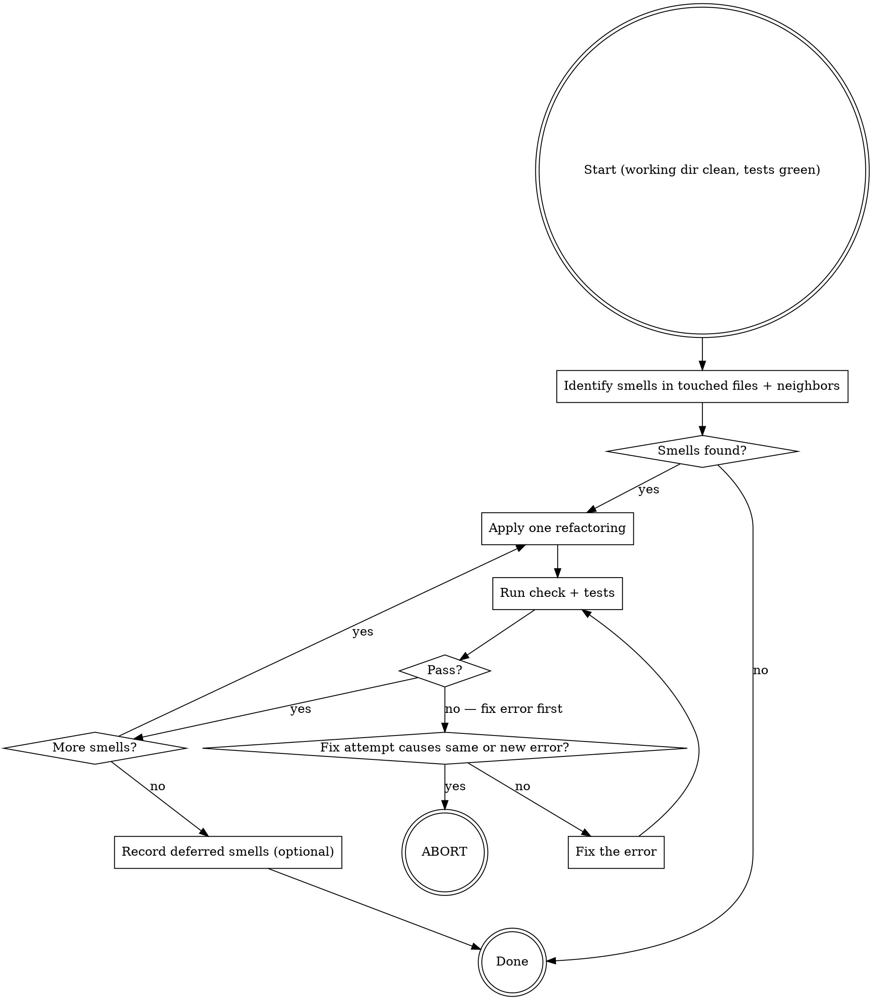

# developer:refactoring

## Overview

Post-green cleanup. Runs only when tests are green and the working directory is clean. Applies one refactoring at a time, verifying after each. Stops when the smell is gone — not when the code is maximally elegant.

**Guard:** Check `git status` before starting. If the working directory is not clean, abort immediately:

> "Working directory is not clean. Please commit or stash your changes, then restart the refactoring step."

**Constraint:** Never refactor behavior and structure simultaneously. If any check or test fails during refactoring, fix the code first — then restart the refactoring step.

## Behavior

1. Identify code smells in files touched in this loop and their logical neighbors.
2. Make an in-memory plan of specific refactorings to apply.
3. Apply each refactoring one at a time. After each: run check, run tests.
4. Abort on repeated errors (see below).
5. Stop when the smell is gone.
6. Optionally record deferred smells.

## Code Smells to Target

- Long function — extract smaller functions
- Repeated conditional — replace with guard clause or lookup
- Primitive obsession — introduce a newtype or value object
- Related parameters — group into a struct/object
- Unclear name — rename to express intent
- Duplicated logic — extract shared function

Do not refactor architecture, module boundaries, or anything not touched by this loop.

## Refactoring Loop



## Abort on Repeated Errors

If a refactoring causes an error and a fix attempt causes the same or a new error, abort:

> "Refactoring caused an error that I couldn't fix cleanly. Review the current diff (`git diff`) or restore the working directory (`git restore .`) and try again."

Do not continue refactoring after an abort. Do not try another refactoring.

## Deferred Smells

If smells remain that are too risky to address now (e.g., would require changing multiple modules), record them:

Save to `docs/developer/YYYY-MM-DD-<topic>/deferred-refactoring.md`:

```markdown
# Deferred Refactoring

- `src/auth/handler.rs:42-80` — handler is too long; extract `validate_token` and `build_session`
- `src/auth/handler.rs:55` — magic string `"Bearer "` should be a constant
```

## Logical Neighbors

"Logical neighbors" means files that share responsibility with the files changed in this loop — not files that happen to be in the same directory. Ask: would a change to this file likely require a change to the neighbor? If yes, it's a logical neighbor.
