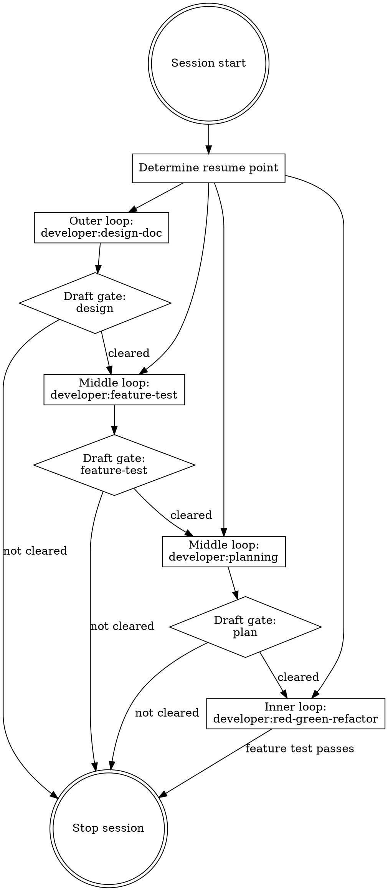

# developer:run

## Overview

Session coordinator for a development loop. Creates and manages the session folder, passes it to each skill, enforces draft gates, and determines where to resume when re-entering an existing session.

**Announce at start:** "Using developer:run to coordinate this session."

## Session Folder

If it does not exist, create `docs/developer/YYYY-MM-DD-A-<topic>` where `A` is `A`, `B`, `C`, etc to manage multiple features started in the same day. If not already on a branch of the same name, use `developer:git-workflow` to suggest moving to that branch.

If the folder already exists for the current topic, determine resume point:

| Files present | Draft marker cleared? | Resume at |
|---|---|---|
| No files | — | Outer loop (design-doc) |
| `design.md` | No | Wait — ask user to clear the draft |
| `design.md` | Yes | Middle loop (feature-test) |
| `feature-test.md` | No | Wait — ask user to clear the draft |
| `feature-test.md` | Yes | Middle loop (planning) |
| `plan.md` | No | Wait — ask user to clear the draft |
| `plan.md` | Yes | Inner loop (red-green-refactor) |

A file has its draft cleared when it no longer contains the `*Draft` marker.

## Loop Structure

## Draft Gate Enforcement

After any outer or middle loop skill (design-doc, feature-test, planning) produces output, stop the session and tell the user:

> "This step is complete. Review `<path>`, make any changes, then remove the `*Draft YYYY-MM-DD*` marker from the top of the file. Start a new session and run `developer:run` to continue."

**Do not proceed past a draft gate in the same session under any circumstances.** If the user asks to continue anyway, decline:

> "I can't continue past the draft gate in this session. The draft gate exists so you have a chance to review and refine before the next step builds on it."

## Skill Invocations

Pass the session folder path to each skill. The session folder is the single source of truth for all session artifacts.

- Outer loop: invoke `developer:brainstorming` or `developer:design-doc`
- Middle loop entry: invoke `developer:feature-test`
- Middle loop planning: invoke `developer:planning`
- Inner loop: invoke `developer:red-green-refactor`

## Topic Slug

If the user's prompt doesn't make the topic slug obvious, ask for one before creating the session folder:

> "What's a short slug for this session? (e.g., `user-auth`, `csv-export`)"

Use it to name the session folder: `docs/developer/YYYY-MM-DD-<topic>/`.

## Session Artifacts

All artifacts for a session live under `docs/developer/YYYY-MM-DD-A-<topic>/`.

- `design.md` is the overal design doc for a topic.
- `feature-test.md` is a specific plan for the feature test for this topic.
- `maps/<path>.md` contains the maps found during any forward/backward planning. 
- `thinking/` is a scratch pad area for the `thinking` skill to share its findings with the calling agent.

## Next Task

When finishing a session, append the next step to `docs/developer/TASKS.md`. When calling run, read `TASKS.md` first, then compare the user's input to the list of next steps. If the next step is obvious from context, run that. If there is no next step, start from the top. If the next step is ambiguous, ask whether they want to pick from a list or start a new developer task. When you start a task, remove it from `TASKS.md`.