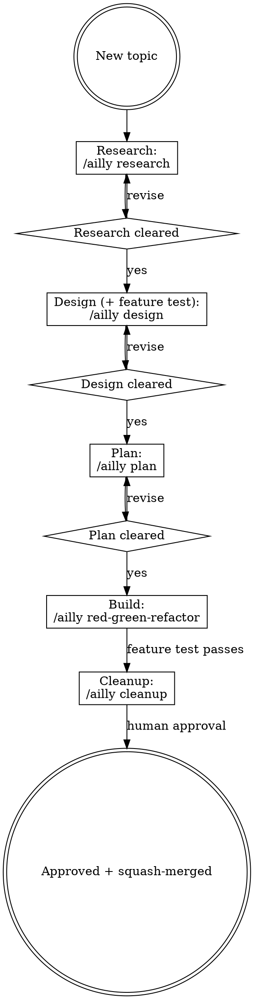

# Using Developer Skills

## Five-Phase Lifecycle

Developer work runs through five phases: Research, Design, Plan, Build, Cleanup. Each of the first three is separated from the next by a human-review draft gate, and red-green-refactor is the Build loop. The five phases are **not standalone skills**: they are entered through the `developer:ailly` coordinator by phase argument (`/ailly design ...`), which selects the matching `references/phases/<phase>.md` and runs it in an isolated phase subagent. Invoke `developer:ailly` and let it route to the phase you are in (with no argument it resumes at the correct phase).

## Skill Routing Table

The five lifecycle phases (research, design, plan, red-green-refactor, cleanup) are entered through the coordinator by argument, not as standalone skills. Everything else is an auxiliary skill invoked directly.

| Situation | Invoke |
|---|---|
| Starting a session for a new or in-progress feature (or resuming one) | `developer:ailly` |
| Gathering and refining context for a vague new topic, with nothing written yet | `developer:ailly research` |
| Exploring a new idea, clarifying requirements, and producing a formal design doc plus its one feature test | `developer:ailly design` |
| Breaking a failing feature test into implementation steps | `developer:ailly plan` |
| Implementing a plan step with TDD | `developer:ailly red-green-refactor` |
| Finishing the topic: final review, extract deferred tasks, prepare the squash-merge | `developer:ailly cleanup` |
| Debugging a compiler error or test failure during TDD | `developer:thinking` |
| Cleaning up green code mid-build, without changing behavior | `developer:refactor` |
| Setting up a new project or language environment | `developer:initialize` |
| Wiring Ailly to the team's issue tracker and document system (once per project) | `developer:configuring-program-management` |
| Reading the next task from the tracker or writing deferred work back during a session | `developer:using-program-management` |

## Draft Gates

The research, design, and plan phases each produce a `*Draft YYYY-MM-DD*` artifact. A human must review and clear the draft marker before the next phase begins. `developer:ailly` enforces this and will not proceed past a draft gate in the same session. After cleanup, the coordinator pauses for human approval before the squash-merge.

| Gate | Location | Clears to enter |
|---|---|---|
| Research notes | `.ailly/developer/YYYY-MM-DD-A-<topic>/research.md` | Design phase |
| Design doc (with feature test) | `.ailly/developer/YYYY-MM-DD-A-<topic>/design.md` | Plan phase |
| Plan | `.ailly/developer/YYYY-MM-DD-A-<topic>/plan.md` | Build (red/green/refactor) |
| Cleanup approval (human sign-off, not a draft file) | — | Squash-merge or PR |