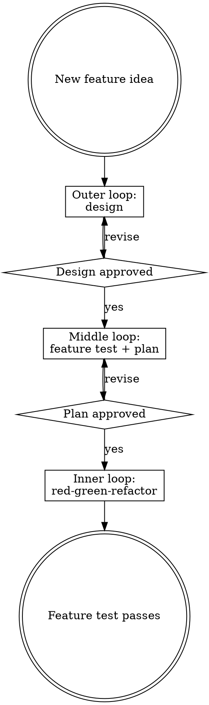

# Using Developer Skills

## Three-Loop Architecture

Developer work is organized into three nested loops. Each loop has its own skill. Invoke the skill for the loop you are currently in.

## Skill Routing Table

| Situation | Invoke |
|---|---|
| Starting a session for a new or in-progress feature | `developer:run` |
| Exploring a new idea, clarifying requirements, producing a design doc | `developer:brainstorming` |
| Formatting or structuring a design doc | `developer:design-doc` |
| Writing the feature test (design approved, no test yet) | `developer:feature-test` |
| Breaking a failing feature test into implementation steps | `developer:planning` |
| Implementing a plan step with TDD | `developer:red-green-refactor` |
| Stuck on a compiler error or test failure during TDD | `developer:thinking` |
| Tests are green; cleaning up code before finishing | `developer:refactoring` |
| Setting up a new project or language environment | `developer:initialize` |
| Converting a spec into a general implementation plan | `developer:writing-plans` |

## Draft Gates

The outer and middle loops produce `*Draft YYYY-MM-DD*` artifacts. A human must review and clear the draft marker before the next loop begins. `developer:run` enforces this — it will not proceed past a draft gate in the same session.

| Artifact | Location | Clears to enter |
|---|---|---|
| Design doc | `docs/developer/YYYY-MM-DD-A-<topic>/design.md` | Middle loop |
| Feature test | `docs/developer/YYYY-MM-DD-A-<topic>/feature-test.md` | Planning |
| Plan | `docs/developer/YYYY-MM-DD-A-<topic>/plan.md` | Inner loop |