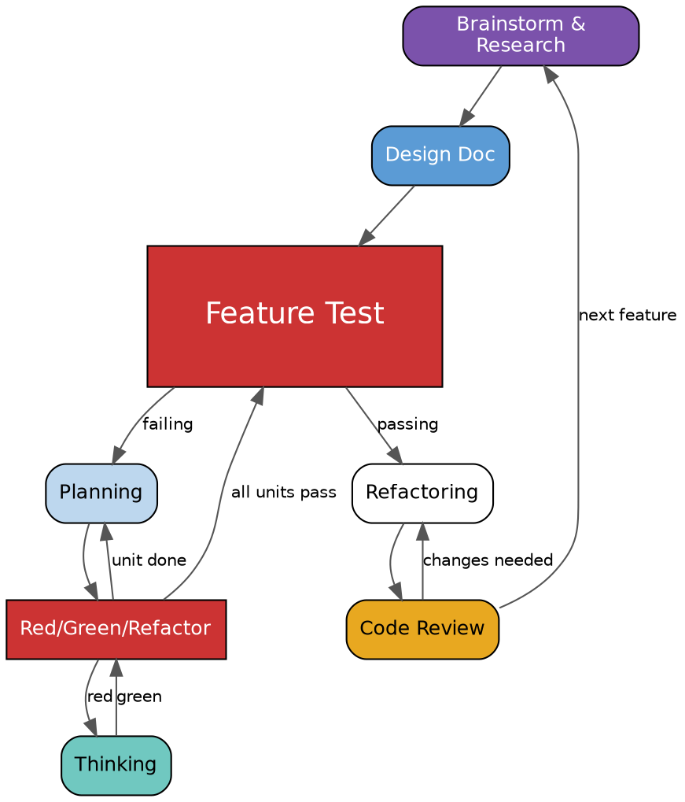

The developer skills are for augmenting the day-to-day practices of an independent contributor software engineer. These skills proceed in three loops. At the outer level, the work product is a Design Doc to be used in the inner steps. In the middle level, the loop begins with a feature test or tests that, when passing, shows the overall task is complete. In the tightest level, the agent performs a type-first test-driven development loop (red/green/refactor).

# Big Steps

Each big step should result in one or a small few documents. These documents should be marked `*Draft YYYY-MM-DD*`. The agent and agent skills are never allowed to remove the `*Draft*` marker. Only a human may move a big-step file out of draft. Small steps should exit before doing anything if their big step files are still marked `*Draft*`.

Big steps should stop completely when finished, and decline proceeding to further steps in the same session. They may continue to edit their drafts at the request of the user, but must not remove the Draft marker. Any requests to move to later steps or move the draft marker should be politely declined, with instructions for the user on what to do next.

Big steps should make use of `domain:` tools to anchor their output in the ubiquitous language of the project.

## Brainstorm & Research

Explore the prompt and feature collaboratively. Use `research:` tools to get a good understanding of the pieces both locally and publicly availalbe. Ask clarifying questions based on this research. Try to ask multiple choice questions. Prepare a file in `docs/developer/YYYY-MM-DD-A-<topic>/research.md` for further tasks to reference.

## Design Doc

When research is complete and no longer in draft, prepare a design doc for the feature.

A design doc is a specification for how to develop a single component in a larger system. Should be one page for a typical small component, or five pages for a substantially larger ensemble component. Most design docs are for small components; confirm before making a larger doc.

A design doc has these sections.

- **Problem Statement** of the problem this component will solve.
- **Prior Art** of similar or suggestive components to learn from.
- **Metrics** that determine whether the deployed design is operating within acceptable constraints.
- **Specification** of the technical details to implement, and the challenges to meet those constraints. (This section should lean heavily on `patterns:` skills.)
- **Alternatives** considered and why existing off-the-shelf tools are not suitable to this problem.
- **Summary** including any deferred technical decisions.

## Feature Test

A feature test (sometimes called an integration or end to end test) is an executable program, independent of the main program being written, that automatically runs through a user story and asserts that it could be completed as expected. The feature test will write code, but also a user story. Since it is a test, it should be relatively direct and straightforward. However, for more complex UI features, introducing Page Object abstractions is appropriate.

## Planning

Follow the `superpowers:writing-plans` skill relatively closely for how to create plans, but keep the language more professional and use the folder structure from this prompt instead. The plan should discuss how to make piecemeal progress in the implementation to complete the feature test. For example, if the feature test is for a uploading a photo, the small steps loop does not need to complete the entire flow in one shot. Instead, the plan might include one step to show the home page with an upload link to a blank page, a second step to create the form UI on that page, a third step to handle uploading the photo, and a final step to finish redirecting to the home page and showing the uploaded photo.

When preparing a plan, proactively consider a zeroeth "domain object design" step that introduces any new domain objects for these steps. Lean heavily on the `patterns:` skills.

# Small Steps

These small steps are the tight loop for implementing code directly. Each step of the plan should execute the red/green/refactor loop until it has gotten to the appropriate point of completing the feature test.

## Red/Green/Refactor

The overall red/green/refactor loop is the core of test driven development. This red/green/refactor loop additionally does type checking first. Before writing any implementation, the class, object, function, method, etc signatures should be written and verified using the `check` action or hook (see Initialize, below) and a `todo!()` or `...` or return default value body.

Once the signatures are complete, the developer can start writing test implementations. The skill should use `pattern:arrange-act-assert` for each implementation. After adding a test implementation, first ensure it still passes type checking, then run the tests. Then replace the stubbed method body with the appropriate code.

Repeat this process - edit, check, test, edit, check, test - until all tests are passing and, while the functional test may not be completely passing, is running up to the point expected by the plan step. At this point, the project is "green". Make a commit, then perform the `developer:refactoring` step with a focus on the edited files and their nearby portions, then move on to `developer:code-review`.

## Thinking

At some point in the edit-check-test portion of the red-green-refactor loop, a non-obvious situation may occur. Common indicators are an error unrelated to the code that's been added or edited in this step of the plan, or the same or substantially similar error has been seen multiple times. At that point, activate the thinking skill and take things slow.

The thinking skill should always run in a subagent, to have fresh context. The skill should get a summary of the situation at the time of the error, with no editorialization. The thinking skill must not edit or run code, but it may use `research:` tasks. The subagent should prepare a file in `docs/developer/YYYY-MM-DD-A-<topic>/thinking/<problem>.md` with a plan for next steps (not a full plan as in the `developer:planning` skill, but similar details).

Notes on how to read an error message?

## Refactoring

Apply refactoring to the areas of code that was created in this loop, and its nearby areas (logically, not physically). Refactoring changes the code without changing the behavior. The skill should first identify candidates for refactoring, including the specific refactorings to apply. It should make an in-memory plan on what refactorings to make. It then follows that plan, doing each refactoring in order.

The scope of each refactor should be minimal. Duplication is a signal to act, not a mandate to generalize. Over-tidying feels productive but consumes the time and energy needed for further work. Refactoring ends when the smell is gone and tests remain green. The code does not need to be maximally elegant.

Do not refactor without a passing test suite, as there is no way to verify that the change preserved behavior. Tests are the safety net that makes refactoring possible. Work on either the code or the tests, but not both at once. The "Refactoring Cat" failure mode — attempting too many simultaneous changes and ending up confused about what broke — is avoided by keeping each refactoring small, isolated, and immediately verified. Single-focus commits enforce this discipline. The "Testing Goat" success mode is slow, steady, deliberate steps.

Always run checks and tests after each change.

Do not continue refactoring in the face of repeated errors. If a refactoring causes an error, it's OK to try and fix it. But if at any time an error is repeated after changes, or additional changes keep causing new errors, abort and suggest the user either review the current diff, or restore the workign directory and try again.

Do not refactor if the working directory is not clean. Abort and tell the user they can begin the refactoring step again if desired.

The trigger for refactoring is usually a code smell: a long function, duplicated logic, a conditional that branches on type, a cluster of related arguments that travel together. Common responses include extracting a function or variable to name a concept, renaming to restore lost meaning, replacing nested conditionals with guard clauses, and grouping related parameters into a coherent object.

This step does not need to correct every smell or refactoring, or even any. It may also create a file describing a refactoring to perform at a later date.

## Code Review

(This Skill has already been written, but feel free to improve it.)

# Additional skills

These additional skills aren't part of the core Developer loop, but show up often enough to need dedicated skills.

## using-developer

Prepare a `using-developer` skill that describes the overall coordination of the skills in this loop. It should create the scratch directory `docs/developer/YYY-MM-DD-<topic>/` folder, and pass that folder (or the `<topic>`) to each skill. It should re-confirm that big-step skills should stop their session when finished, and prompt the user on how to start a new session continuing the process when the `*Draft*` flags are cleared.

## Initialize

The initalize skill prepares a folder to work for a certain language. Using this skill will validate the folder is in a good place for development, and suggest edits and changes if not.

Format after every edit. (Hook)
Check before running tests. (Skill Step)
Test after every change. (Skill Step)
Lint after every task. (Skill Step)
Run the command or start the server.

The initialize skill should describe how to decide the above settings independent of language or tool, and each of the following languages and tools should have their own reference files.

### Rust

Use Cargo and Clippy. The project should use `tests/` for feature tests, and `src/` for the main crate. Feel free to run `cargo init` with appropriate flags.

### Python

Preapre a local, non-published Python project that uses uv for package management, ruff for formatting and linting, and pyright for type checking & lsp. It should follow PyPA conventions for package source and test layout. It should have at least one module for the initial application, and one module for feature tests.

### TypeScript

Prepare a local, non-published TypeScript project that uses vite and vitest for bundling and serving, and biome for formatting and linting. It should use the most recent TypeScript with strict compiler settings. Follow the prompt to decide whether it's a browser, server, edge, or mixed project. As TypeScript is the most varied target, feel comfortable asking more questions of the user. Also feel free to find an appropriate `npm init` repo, and either run it for the user or provide instructions for them to run it themselves.

### Mise

Mise en place & use beta mise monorepo settings. These can wrap any or several of the above configurations.

`mise format` -> Formatter on changed files
`mise test [pattern]` -> Run a subset of tests, possibly filtered by a pattern
`mise check [pattern]` -> Run static analysis checks, possibly filtered by a pattern
`mise lint [pattern]` -> Run linting checks, possibly filtered by a pattern
`mise run ...` -> Run the binary or CLI program
`mise serve ...` -> Start the dev or production server, if present

# Final notes

Use standard thinking to begin expanding on this request, then use subagents for each skill in isolation. The subagents should work on their respective skills, starting with `research:` skills and then using `writing-skills`.