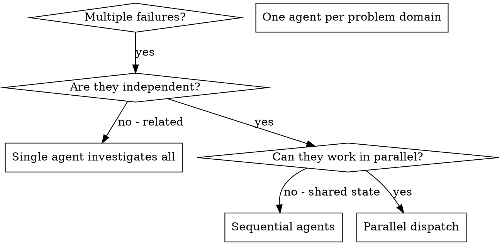

# Dispatching Parallel Agents

## Overview

Delegate tasks to specialized agents with isolated context. Craft their instructions precisely so each agent stays focused on one problem domain without inheriting your session's history. This preserves your own context for coordination work.

When multiple unrelated failures appear across different test files or subsystems, investigating them sequentially wastes time. Each investigation is independent and can happen concurrently.

**Core principle:** One agent per independent problem domain. Let them work concurrently.

## When to Use



**Use when:**
- Three or more test files failing with different root causes
- Multiple subsystems broken independently
- Each problem can be understood without context from others
- No shared state between investigations

**When NOT to use:**
- Failures are related (fixing one might fix others — investigate together first)
- Understanding requires seeing the full system state
- Agents would interfere with each other (editing same files, shared resources)
- The failure scope is not yet known

## The Pattern

### 1. Identify Independent Operations 

Group failures by what is broken:
- File A tests: Tool approval flow
- File B tests: Batch completion behavior
- File C tests: Abort functionality

Group research by various areas
- Internal search for conversations and designs
- Codebase search for existing implementation
- Public search for external context.

Each domain is independent — fixing tool approval does not affect abort tests.

### 2. Create Focused Agent Tasks

Each agent gets:
- **Specific scope:** One test file or subsystem
- **Clear goal:** Make these tests pass
- **Constraints:** Do not change other code
- **Expected output:** Summary of root cause and what was fixed

### 3. Dispatch in Parallel

```typescript
Task("Fix agent-tool-abort.test.ts failures")
Task("Fix batch-completion-behavior.test.ts failures")
Task("Fix tool-approval-race-conditions.test.ts failures")
// All three run concurrently
```

### 4. Review and Integrate

When agents return:
- Read each summary
- Verify fixes do not conflict
- Run full test suite
- Integrate all changes

## Agent Prompt Structure

Effective agent prompts are focused, self-contained, and specific about expected output:

```markdown
Fix the 3 failing tests in src/agents/agent-tool-abort.test.ts:

1. "should abort tool with partial output capture" - expects 'interrupted at' in message
2. "should handle mixed completed and aborted tools" - fast tool aborted instead of completed
3. "should properly track pendingToolCount" - expects 3 results but gets 0

These are timing/race condition issues. Your task:

1. Read the test file and understand what each test verifies
2. Identify root cause - timing issues or actual bugs?
3. Fix by:
   - Replacing arbitrary timeouts with event-based waiting
   - Fixing bugs in abort implementation if found
   - Adjusting test expectations if testing changed behavior

Do NOT just increase timeouts - find the real issue.

Return: Summary of what you found and what you fixed.
```

## Common Mistakes

**❌ Too broad:** "Fix all the tests" — agent gets lost.
**✅ Specific:** "Fix agent-tool-abort.test.ts" — focused scope.

**❌ No context:** "Fix the race condition" — agent does not know where to look.
**✅ Context:** Paste the error messages and test names.

**❌ No constraints:** Agent might refactor unrelated code.
**✅ Constraints:** "Do NOT change production code" or "Fix tests only."

**❌ Vague output:** "Fix it" — no record of what changed.
**✅ Specific:** "Return summary of root cause and changes."

## Verification

After agents return:
1. **Review each summary** — understand what changed and why
2. **Check for conflicts** — did agents edit the same code?
3. **Run full suite** — verify all fixes work together
4. **Spot check** — agents can make systematic errors; read key diffs
