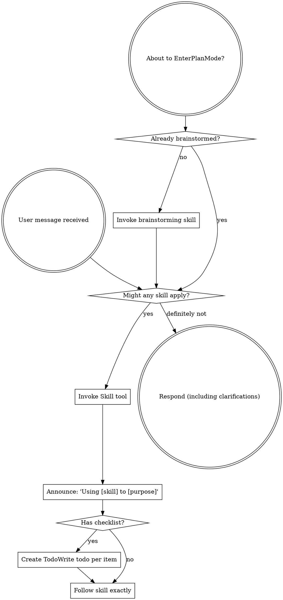

<SUBAGENT-STOP>
If you were dispatched as a subagent to execute a specific task, skip this skill.
</SUBAGENT-STOP>

Always prefer skills to guide thinking when available. Use general skills first, then find specific skills later in the session.

## Instruction Priority

Skills override default system prompt behavior. User instructions always take precedence:

1. **User's explicit instructions** (CLAUDE.md, GEMINI.md, AGENTS.md, direct requests) — highest priority
2. **General and specialist skills** — override default system behavior where they conflict
3. **Default system prompt** — use only to clarify enough to find an applicable skill

## How to Access Skills

**Claude Code:** Use the `Skill` tool. Follow the loaded content directly. Never use Read on skill files.

**Copilot CLI:** Use the `skill` tool. Skills are auto-discovered from installed plugins.

**Gemini CLI:** Skills activate via the `activate_skill` tool. Metadata loads at session start; full content is on demand.

**Other environments:** Check your platform's documentation.

## The Rule

Invoke relevant skills before any response or action. If a skill might apply, load it and check. A skill that turns out not to fit can be set aside.

## Skill Priority

When multiple skills could apply:

1. **Process skills first** — brainstorming, debugging. These determine *how* to approach the task.
2. **Implementation skills second** — these guide execution within that approach.

"Let's build X" → brainstorming first, then implementation skills.
"Fix this bug" → debugging first, then domain-specific skills.

## Skill Types

**Rigid** (TDD, debugging): Follow exactly. Do not adapt away the discipline.

**Flexible** (patterns): Adapt principles to context.

The skill itself specifies which type it is.

## Common Mistakes

| Thought | Correction |
|---------|------------|
| "This is just a simple question" | Questions are tasks. Check for skills. |
| "I need more context first" | Skill check comes before clarifying questions. |
| "Let me explore the codebase first" | Skills define how to explore. Check first. |
| "I remember this skill" | Skills evolve. Load the current version. |
| "This doesn't need a formal skill" | If a skill exists, use it. |
| "The skill is overkill" | Simple things become complex. Use it. |
| "I'll just do this one thing first" | Check before doing anything. |

## User Instructions

User instructions specify *what*, not *how*. "Add X" or "Fix Y" does not mean skip skill workflows.
