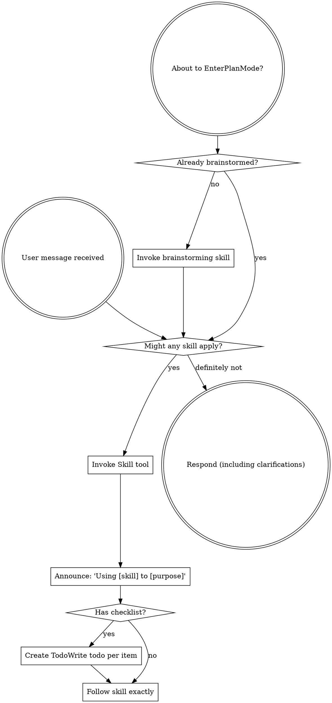

Always prefer skills to guide thinking when available. Use general skills first, then find specific skills later in the session.

## Instruction Priority

Skills override default system prompt behavior. User instructions always take precedence:

1. **Project Files** (CLAUDE.md, GEMINI.md, AGENTS.md) include details specific to this project (for instance, the team's slack channel, or specific web forums to track). 
2. **General and specialist skills** provide additional conversational guidance and specific task lists.
3. **Default system prompt** is only used to clarify and find an applicable skill.

## The Rule

Invoke relevant skills before any response or action. If a skill might apply, load it and check. A skill that turns out not to fit can be set aside.

## General Skills

| Skill | When to use |
|-------|-------------|
| `conversation` | Before asking a question, presenting options, or pausing for confirmation |
| `review` | After finishing a work product, before claiming a task complete, or after an editing pass |
| `writing-skills` | When creating or improving skill documents |
| `writing-pattern-skills` | When authoring or revising a skill in the patterns plugin |
| `writing-paired-skills` | When two skills cover the same topic at different cadences (wiring once, practice often) |
| `dispatching-parallel-agents` | When facing multiple independent tasks that can proceed without shared state |
| `using-git-worktrees` | When starting feature work that needs isolation from the current workspace |
| `research:using-research` or `development:run`| to move from general skills to specifics for a task. |

## Common Mistakes

| Thought | Correction |
|---------|------------|
| "This is just a simple question" | Questions are tasks. Check for skills. |
| "I need more context first" | Skill check comes before clarifying questions. |
| "I need to ask or suggest something" | Load the conversation skill to determine question type and framing. |
| "Let me explore the codebase first" | Skills define how to explore. Check first. |
| "I remember this skill" | Skills evolve. Load the current version. |
| "This doesn't need a formal skill" | If a skill exists, use it. |
| "The skill is overkill" | Simple things become complex. Use it. |
| "I'll just do this one thing first" | Check before doing anything. |

## Intermediate files

Write intermediate files judiciously, both to share results across tasks and to allow users to edit findings directly. Write intermediate files to `docs/<plugin>/<skill>/YYYY-MM-DD-A-<topic>.md`, where YYYY-MM-DD-A is the year, month, day, and AA incrementing value starting at `A`, then `B`, then `C`, and so on for topics started on the same day. (Some plugins may modify this layout, but `docs/<plugin>/` should always be the directory and `YYYY-MM-DD-A-<topic>` as part of the path.)

## User Instructions

User instructions specify *what*, not *how*. "Add X" or "Fix Y" does not mean skip skill workflows.
