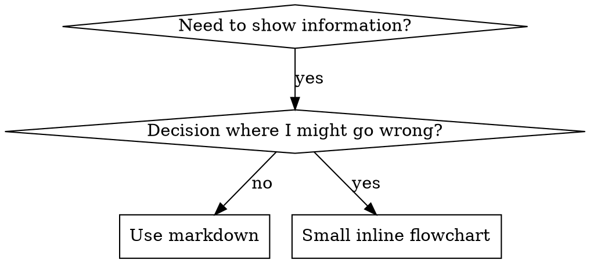

# Writing skills

## Overview

Writing skills is Test-Driven Development applied to process documentation.

Write test cases (pressure scenarios with subagents) and watch them fail. Document baseline behavior. Write the skill documentation and watch tests pass with agent compliance. Then refactor to close loopholes.

**Core principle:** if you did not watch an agent fail without the skill, you do not know if the skill teaches the right concept.

**Background:** understand `superpowers:test-driven-development` before using this skill. That skill defines the fundamental RED-GREEN-REFACTOR cycle. This skill adapts TDD to documentation.

**Official guidance:** for Anthropic's official skill authoring best practices, see `anthropic-best-practices.md`. That document complements the TDD-focused approach here.

## What is a skill?

A **skill** is a reference guide for proven techniques, patterns, or tools. Skills enable future Claude instances to find and apply effective approaches.

**Skills are:** reusable techniques, patterns, tools, reference guides.

**Skills are not:** narratives about a problem someone solved once.

## TDD mapping for skills

| TDD Concept | Skill Creation |
|-------------|----------------|
| **Test scenario** | Pressure scenario with subagent |
| **Production code** | Skill document (SKILL.md) |
| **Test fails (RED)** | Agent violates rule without skill (baseline) |
| **Test passes (GREEN)** | Agent complies with skill present |
| **Refactor** | Close loopholes while maintaining compliance |
| **Write test first** | Run baseline scenario before writing skill |
| **Watch it fail** | Document exact rationalizations agent uses |
| **Minimal code** | Write skill addressing those specific violations |
| **Watch it pass** | Verify agent now complies |
| **Refactor cycle** | Find new rationalizations → plug → re-verify |

The entire skill creation process follows RED-GREEN-REFACTOR.

## When to create a skill

**Create when:**
- The technique was not intuitively obvious
- You would reference it again across projects
- The pattern applies broadly (not project-specific)
- Others would benefit

**Do not create for:**
- One-off solutions
- Standard practices well-documented elsewhere
- Project-specific conventions (put in CLAUDE.md)
- Mechanical constraints (if enforceable with regular expressions and validation, automate instead)

## Skill types

### Technique
Concrete method with steps to follow (condition-based-waiting, root-cause-tracing).

### Pattern
Way of thinking about problems (flatten-with-flags, test-invariants).

### Reference
API docs, syntax guides, tool documentation.

## Directory structure

```
skills/
  skill-name/
    SKILL.md              # Main reference (required)
    supporting-file.*     # Only if needed
```

**Flat namespace**—all skills in one searchable namespace.

**Separate files for:**
1. **Heavy reference** (100+ lines)—API docs, comprehensive syntax
2. **Reusable tools**—Scripts, utilities, templates

**Keep inline:**
- Principles and concepts
- Code patterns (< 50 lines)
- Everything else

## SKILL.md structure

**Frontmatter (YAML):**
- Two required fields: `name` and `description`. See [agentskills.io/specification](https://agentskills.io/specification) for all supported fields.
- Max 1024 characters total
- `name`: Use letters, numbers, and hyphens only (no parentheses, special chars)
- `description`: Third-person, describes when to use (not what the skill does)
  - Start with "Use when" followed by specific triggering conditions
  - Include specific symptoms, situations, and contexts
  - Never summarize the skill's process or workflow (see CSO section)
  - Keep under 500 characters if possible

```markdown
---
name: Skill-Name-With-Hyphens
description: Use when [specific triggering conditions and symptoms]
---

# Skill Name

## Overview
What is this? Core principle in 1-2 sentences.

## When to Use
[Small inline flowchart IF decision non-obvious]

Bullet list with symptoms and use cases.
When NOT to use.

## Checklist
A checklist of TODO items for this skill.
Usually starts with invoking research: skills.

## Core Pattern (for techniques/patterns)
Before/after code comparison.

## Quick Reference
Table or bullets for scanning common operations.

## Implementation
Inline code for simple patterns.
Link to file for heavy reference or reusable tools.

## Common Mistakes
What goes wrong + fixes.
```

## Claude search optimization (CSO)

**Critical for discovery:** future Claude needs to find your skill.

### 1. Rich description field

**Purpose:** claude reads the description to decide which skills to load for a given task. Make it answer: "is this the right skill?"

**Format:** start with "Use when [specific conditions]" to focus triggering conditions.

**Description = When to Use, not What the Skill Does**

The description should describe triggering conditions only. Do not summarize the skill's process or workflow.

**Why this matters:** testing revealed a critical issue. When descriptions summarize workflow, Claude may follow them instead of reading the skill fully. A description like "code review between tasks" caused Claude to do one review, despite the flowchart showing two. Changing to triggering conditions only solved this. The new description, "Use when executing implementation plans with independent tasks," caused Claude to read and follow the full flowchart.

Descriptions that summarize workflow create shortcuts Claude takes, resulting in skipped skill documentation.

```yaml
# Summarizes workflow - Claude may follow this instead of reading skill
description: Use when executing plans - dispatches subagent per task with code review between tasks

# Too much process detail
description: Use for TDD - write test first, watch it fail, write minimal code, refactor

# Triggering conditions only
description: Use when executing implementation plans with independent tasks in the current session

# Triggering conditions only
description: Use when implementing any feature or bugfix, before writing implementation code
```

**Content guidelines:**
- Use concrete triggers, symptoms, and situations
- Describe the *problem*, not language-specific symptoms (race conditions, not setTimeout)
- Keep triggers technology-agnostic unless the skill itself is technology-specific
- Write in third person (injected into system prompt)
- Never summarize the skill's process or workflow

```yaml
# Too abstract, vague
description: For async testing

# First person
description: I can help you with async tests when they're flaky

# Mentions technology but skill is not specific to it
description: Use when tests use setTimeout/sleep and are flaky

# Starts with "Use when", describes problem, no workflow
description: Use when tests have race conditions, timing dependencies, or pass/fail inconsistently

# Technology-specific skill with explicit trigger
description: Use when using React Router and handling authentication redirects
```

### 2. Keyword coverage

Use words Claude would search for:
- Error messages: "Hook timed out, ENOTEMPTY, race condition"
- Symptoms: "flaky, hanging, zombie, pollution"
- Synonyms: "timeout/hang/freeze, cleanup/teardown/afterEach"
- Tools: Actual commands, library names, file types

### 3. Descriptive naming

Use active voice, verb-first:
- `creating-skills` not `skill-creation`
- `condition-based-waiting` not `async-test-helpers`

Gerunds (-ing) work well for processes: `creating-skills`, `testing-skills`, `debugging-with-logs`.

### 4. Token efficiency

Skills loaded frequently accumulate cost per conversation. Keep frequently loaded skills concise.

**Target word counts:**
- Getting-started workflows: < 150 words each
- Frequently loaded skills: < 200 words total
- Other skills: < 500 words

**Techniques:**

Move details to tool documentation instead of documenting all flags inline. Use `--help` references.

Use cross-references rather than repeating workflow details from other skills.

Compress examples. One concise example communicates better than a verbose walkthrough.

Eliminate redundancy: do not repeat what is in cross-referenced skills, do not explain what is obvious from the command, do not include multiple examples of the same pattern.

### 5. Cross-referencing other skills

Use skill name only, with explicit requirement markers:
- `**Background:** Use superpowers:test-driven-development`
- `**Required sub-skill:** Use research:codebase`

Avoid `@` link syntax. It force-loads files immediately, consuming context before you need them.

## Flowchart usage



Use flowcharts only for:
- Non-obvious decision points
- Process loops where stopping early is a risk
- "When to use A vs B" decisions

Do not use flowcharts for reference material; use tables instead. Do not use them for code examples; use markdown blocks instead. Do not use them for linear instructions; use numbered lists instead. Do not use labels without semantic meaning.

See `@graphviz-conventions.dot` for graphviz style rules.

**Rendering for review:** use `render-graphs.js` in this directory to render a skill's flowcharts to SVG:
```bash
./render-graphs.js ../some-skill           # Each diagram separately
./render-graphs.js ../some-skill --combine # All diagrams in one SVG
```

## Code examples

One excellent example beats many mediocre ones.

Choose the most relevant language:
- Testing techniques → TypeScript/JavaScript
- System debugging → Shell/Python
- Data processing → Python

A good example is complete and runnable, explains *why* in comments, comes from a real scenario, and is ready to adapt without being a generic template.

Do not implement the same example in 5+ languages or create fill-in-the-blank templates.

## File organization

### Self-contained skill
```
defense-in-depth/
  SKILL.md    # Everything inline
```
Use when all content fits without heavy reference material.

### Skill with reusable tool
```
condition-based-waiting/
  SKILL.md    # Overview + patterns
  example.ts  # Working helpers to adapt
```
Use when the tool is reusable code, not just narrative.

### Skill with heavy reference
```
pptx/
  SKILL.md       # Overview + workflows
  pptxgenjs.md   # 600 lines API reference
  ooxml.md       # 500 lines XML structure
  scripts/       # Executable tools
```
Use when reference material is too large for inline.

## Core rule

Do not deploy a skill without first watching an agent fail without it.

This applies to new skills and to edits of existing skills.

Writing the skill before testing means you do not know what it actually fixes. Editing without testing means you do not know if the change holds under pressure.

**No exceptions:**
- Not for "simple additions"
- Not for "just adding a section"
- Not for "documentation updates"

Delete untested work and start over. Do not keep it as "reference."

## Testing skill types

### Discipline-enforcing skills

**Examples:** tdd, verification-before-completion, designing-before-coding.

**Test with:**
- Academic questions: does the agent understand the rules?
- Pressure scenarios: does the agent comply under stress?
- Combined pressures: time + sunk cost + exhaustion
- Identify rationalizations; add explicit counters

**Success criteria:** agent follows the rule under maximum pressure.

### Technique skills

**Examples:** condition-based-waiting, root-cause-tracing, defensive-programming.

**Test with:**
- Application scenarios: can the agent apply the technique correctly?
- Variation scenarios: does it manage edge cases?
- Missing information tests: do the instructions have gaps?

**Success criteria:** agent successfully applies the technique to a new scenario.

### Pattern skills

**Examples:** reducing-complexity, information-hiding.

**Test with:**
- Recognition scenarios: does the agent recognize when the pattern applies?
- Application scenarios: can it use the mental model?
- Counter-examples: does it know when not to apply?

**Success criteria:** agent correctly identifies when and how to apply the pattern.

### Reference skills

**Examples:** api documentation, command references, library guides.

**Test with:**
- Retrieval scenarios: can the agent find the right information?
- Application scenarios: can it use what it found correctly?
- Gap testing: are common use cases covered?

**Success criteria:** agent finds and correctly applies reference information.

## Resistance testing for discipline-enforcing skills

Skills that enforce discipline need to resist rationalization. Agents find loopholes under pressure.

**Psychology note:** understanding *why* persuasion techniques work helps you apply them systematically. See `persuasion-principles.md` for the research foundation (Cialdini, 2021; Meincke et al., 2025) on authority, commitment, scarcity, social proof, and unity principles.

### Close every loophole explicitly

State the rule and forbid specific workarounds:

```markdown
Write code before test? Delete it. Start over.

**No exceptions:**
- Do not keep it as "reference"
- Do not "adapt" it while writing tests
- Do not look at it
- Delete means delete
```

### Address "spirit vs letter" arguments

Add a foundational principle early:

```markdown
**Violating the letter of the rules is violating the spirit of the rules.**
```

This cuts off rationalizations that claim to follow the spirit.

### Build a rationalization table

Capture rationalizations from baseline testing. Every excuse goes in the table:

```markdown
| Excuse | Reality |
|--------|---------|
| "Too simple to test" | Simple code breaks. Test takes 30 seconds. |
| "I'll test after" | Tests passing immediately prove nothing. |
```

### Create a common mistakes section

Make it easy to self-check:

```markdown
## Common Mistakes

- Code before test
- "I already manually tested it"
- "Tests after achieve the same purpose"
- "This is different because..."
```

## RED-GREEN-REFACTOR for skills

### RED: write failing test (baseline)

Run a pressure scenario with a subagent without the skill. Document exact behavior:
- What choices did the agent make?
- What rationalizations did it use (verbatim)?
- Which pressures triggered violations?

This is "watch the test fail"—you must see what agents naturally do before writing the skill.

### GREEN: write minimal skill

Write a skill that addresses those specific rationalizations. Do not add content for hypothetical cases.

Run the same scenarios with the skill present. The agent should now comply.

### REFACTOR: close loopholes

If the agent finds a new rationalization, add an explicit counter and re-test until the skill holds.

**Testing methodology:** see `@testing-skills-with-subagents.md` for the complete testing methodology. This describes how to write pressure scenarios, apply pressure types (time, sunk cost, authority, exhaustion), and plug holes systematically.

## Anti-patterns

**Narrative example:** "In session 2025-10-03, the team found empty projectDir caused issues"
Too specific, not reusable.

**Multi-language dilution:** `example-js.js`, `example-py.py`, `example-go.go`
Mediocre quality and a maintenance burden.

**Code in flowcharts:**
```dot
step1 [label="import fs"];
step2 [label="read file"];
```
Cannot copy-paste; hard to read.

**Generic labels:** `helper1`, `helper2`, `step3`, `pattern4`
Labels must carry semantic meaning.

## Deployment discipline

Complete the deployment process for each skill before moving to the next. Do not create multiple skills in batch without testing each one. Deploying an untested skill is the same discipline violation as deploying untested code.

## Skill creation checklist

Create a TodoWrite todo for each item.

**RED phase: write failing test:**
- [ ] Create pressure scenarios (3+ combined pressures for discipline skills)
- [ ] Run scenarios without skill, documenting baseline behavior verbatim
- [ ] Identify patterns in rationalizations/failures

**GREEN phase: write minimal skill:**
- [ ] Name uses only letters, numbers, hyphens (no parentheses/special chars)
- [ ] YAML frontmatter with `name` and `description` fields (max 1024 chars; see [spec](https://agentskills.io/specification))
- [ ] Description starts with "Use when [conditions]" and includes specific triggers/symptoms
- [ ] Description written in third person
- [ ] Keywords throughout for search (errors, symptoms, tools)
- [ ] Clear overview with core principle
- [ ] Addresses specific baseline failures identified in RED
- [ ] Code inline or linked to separate file
- [ ] One excellent example (not multi-language)
- [ ] Run scenarios with skill, verifying agents now comply

**REFACTOR phase: close loopholes:**
- [ ] Identify new rationalizations from testing
- [ ] Add explicit counters (for discipline skills)
- [ ] Build rationalization table from all test iterations
- [ ] Create common mistakes section
- [ ] Re-test until the skill holds

**Quality Checks:**
- [ ] Small flowchart only if decision is non-obvious
- [ ] Quick reference table
- [ ] Common mistakes section
- [ ] No narrative storytelling
- [ ] Supporting files only for tools or heavy reference

**Deployment:**
- [ ] Commit skill to git and push to your fork (if configured)
- [ ] Consider contributing back via PR (if broadly useful)

## Discovery workflow

How future Claude finds your skill:

1. **Encounters problem** ("tests are flaky")
2. **Finds skill** (description matches)
3. **Scans overview** (is this relevant?)
4. **Reads patterns** (quick reference table)
5. **Loads example** (only when implementing)

Put searchable terms early and frequently.
